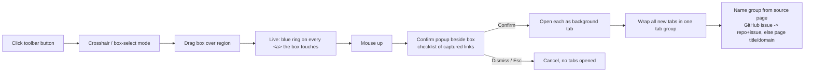

# Box-Select → Tab Group (Browser Extension)

## Problem Frame

When reviewing a set of related links scattered across a region of a page —
canonically a GitHub issue that lists a stack of PR links (e.g.
`acme/api#409`, which enumerates PRs #410–#417) — opening each
link and organizing the resulting tabs into a Chrome tab group is tedious manual
work. A GitHub-specific tool could parse a PR table, but the same friction shows
up on any page with a cluster of links (docs indexes, dashboards, search
results).

This feature adds a **generic gesture**: arm the extension, drag a box over a
region, and every link inside that box opens as one named Chrome tab group.
GitHub issue/PR context only _enriches naming_ — it is not a precondition.

## Flow

## Requirements

**Prerequisite**

- R0. Add `"tabs"` and `"tabGroups"` to the `manifest` permissions override in `package.json` before any tabs/groups API call can function (the current scaffold has only `host_permissions: ["https://*/*"]`).

**Activation & Selection**

- R1. The extension exposes a single toolbar (action) button. Clicking it arms
  "box-select mode": the cursor becomes a crosshair and the active page enters a
  selection state. The button reflects its state — a distinct armed indicator
  (e.g. action badge or filled icon) when active, reverting to idle after the
  group is created or the mode is canceled. (Activation: `popup.tsx` is removed
  so `chrome.action.onClicked` fires on click — see Key Decisions.)
- R2. In box-select mode, the user drags a rectangle over any region of the page
  (mousedown → mousemove → mouseup defines the box).
- R3. Box-select mode is cancelable without creating a group (e.g. `Esc`, or
  re-clicking the toolbar button). On any cancel path the injected UI — overlay,
  box, highlight rings, and any open popup — is removed synchronously. Exact
  cancel gesture decided in planning.
- R3a. Armed mode is scoped to the tab active when it was armed. Switching tabs
  exits armed mode on the original tab (button reverts to idle); it does not arm
  the newly-focused tab.

**Link Capture & Highlighting**

- R4. While dragging, capture every `<a>` whose bounding rectangle **intersects
  (touches)** the selection rectangle. Capture recomputes live as the box
  grows/shrinks. Capture is **viewport-bound**: only links currently rendered in
  the viewport are eligible, so a single gesture cannot span a region taller than
  the screen (multi-screen selection / autoscroll is out of scope for v1 — see
  Deferred to Planning).
- R4a. Intersect capture is deliberately forgiving and **will** also catch
  sticky/fixed page chrome (headers, nav, sidebars, avatars) that overlaps the
  box. v1 pre-filters obvious non-content anchors (zero-size, and no-text /
  no-href anchors); the R8 checklist is the user's safeguard for the rest.
- R5. Each currently-captured link is highlighted in real time with a blue ring
  (`box-shadow: 0 0 0 3px` blue, per user spec) so the user sees exactly what
  will be included.
- R6. Only `http`/`https` links are eligible; ignore `javascript:`, `mailto:`,
  `#`-only fragments, and empty hrefs. Deduplicate identical hrefs **within a
  single selection**.

**Confirmation**

- R7. On mouse-up, show a small confirmation popup anchored **contextually next
  to the selection box** (not a centered modal). Placement collision-resolves
  against the viewport: prefer right of the box, flip to left, then below, and
  clamp within viewport bounds.
- R7a. If the selection captured **zero** eligible links, suppress the popup
  entirely and give brief feedback (e.g. the box flashes a distinct color), then
  exit box-select mode. Never call `chrome.tabs.group` on an empty set (invalid).
- R8. The popup lists the captured links with checkboxes so the user can deselect
  noise before anything opens. It shows a count header (e.g. "12 links"), caps
  visible height with internal scroll, and warns above a high-count threshold
  (the enforcing mechanism behind "no accidental 50-tab blasts"). Confirming
  proceeds; dismissing cancels with no tabs opened.

**Tab Group Creation & Naming**

- R9. On confirm, open each selected link as a **new background tab** in the
  current window. Always open fresh tabs (no reuse/dedupe against already-open
  tabs). The background worker **awaits all `chrome.tabs.create` calls and
  collects their tab IDs before** calling `chrome.tabs.group`, so the group is
  never formed from a partial or empty tab set.
- R10. Wrap all newly-opened tabs into a **single** Chrome tab group with a
  deterministic default color (a fixed color, or one cycled per invocation — not
  random; exact choice in planning).
- R11. Name the group via an explicit fallback chain: (1) source page is a GitHub
  issue/PR URL → `repo + issue` parsed from the URL; (2) any other page → page
  title when non-empty; (3) → hostname; (4) → "Tab Group" as last resort. GitHub
  naming keys off the **source** page, so a GitHub search/repo-index page full of
  PR links falls to step 2, not step 1.
- R12. Tabs keep their **native page titles** in v1 (no per-tab renaming).

## Success Criteria

- On a GitHub issue listing N PR links (e.g. #409), one box-select gesture opens
  all N PRs as background tabs inside one named tab group — zero manual tab/group
  management.
- The user always knows what will open before it opens: live blue-ring highlight
  during drag + a checklist in the confirm popup. No accidental 50-tab blasts.
- On a non-GitHub page with a cluster of links, the same gesture produces a
  sensibly-named group.
- Pressing `Esc` (or the chosen cancel gesture) during box-select mode, or
  dismissing the confirm popup, results in zero new tabs or groups and the page
  returning to its normal state (overlay, box, and highlight rings all removed).

## Scope Boundaries

- **Not GitHub-only.** Works on any page; GitHub issue/PR context only enriches
  the group name.
- **No per-tab renaming** to `[repo #N] title` in v1 (deferred — carries the cost
  of injecting `document.title` per tab and fighting GitHub's SPA title updates).
- **No reuse/dedupe against already-open tabs** — always open fresh.
- **No saving/restoring groups** as reusable workspaces (possible future).
- **Single window only**; tabs open in the current window.
- **Chromium target only** — `chrome.tabGroups` is unsupported on Firefox.

## Key Decisions

- **Plasmo is a confirmed fit** (verified against Plasmo docs): a content script
  owns the overlay, box-draw, live highlight, and confirm popup; the background
  service worker owns the `chrome.tabs` / `chrome.tabGroups` calls; they talk via
  typed `@plasmohq/messaging`. Content scripts cannot call the tabs API directly,
  so the message hop is required.
- **Capture = intersect, not fully-enclosed** — forgiving; easy to grab a column
  or list without precise edges.
- **Generic mechanism + PR-aware naming** — keeps the "generic solution" framing
  while giving the PR-stack use case nice names.
- **v1 minimizes carrying cost** — native tab titles, always-fresh tabs.
- **Activation: remove `popup.tsx`, arm on icon click** — no `default_popup` is
  registered, so the background listens to `chrome.action.onClicked` and messages
  the content script to arm box-select mode. One click = armed (matches R1); a
  popup surface can be reintroduced later if settings are needed.

## Dependencies / Assumptions

- Manifest needs `"tabs"` and `"tabGroups"` added to the `manifest` override in
  `package.json` (currently only `host_permissions: ["https://*/*"]` — verified
  against the current scaffold). See R0.
- `@plasmohq/messaging` must be added to `package.json` dependencies (absent from
  the current scaffold — only `plasmo`, `react`, `react-dom` are installed); it
  provides the typed content-script ↔ background messaging the architecture
  relies on.
- `chrome.tabGroups` requires MV3 (Plasmo default) and is Chromium-only.
- `prTitle` is **not** present in a PR URL (only `repoName` and `prNumber` are).
  Group naming uses the _source page's_ GitHub context (repo + issue from the
  URL), so v1 naming needs **no** async PR-title fetch.
- The user is authenticated to GitHub in the browser, so opened private-repo PR
  tabs load normally — we only open tabs, no GitHub API auth needed.

## Outstanding Questions

### Resolve Before Planning

- (none — all product decisions resolved)

### Deferred to Planning

- [Affects R3][Technical] Exact cancel gesture (`Esc` / re-click toolbar / click
  outside).
- [Affects R4][Technical] Whether to support autoscroll / multi-screen selection
  beyond v1's viewport-bound capture.
- [Affects R5][Technical] Overlay z-index / pointer-capture strategy so the box
  and highlight render above arbitrary page content without breaking the page.
  (Product-lens flagged this cluster as the make-or-break risk — validate on a
  couple of real, messy pages early.)
- [Affects R10/R11][Technical] Exact group color rule and the `repo + issue` name
  template format.
- [Affects R8][Technical] How the popup renders a link with no useful anchor text
  (truncated href?) and the exact high-count warning threshold.
- [Affects R6][Technical] href normalization for dedupe (trailing slash, query
  order, fragments).
- [Affects R9][Technical] Partial-open failure handling (popup-blocked / 404 /
  no-access tabs still join the group) — acceptable for v1, confirm.
- [Affects R4][Needs research] Links inside iframes / shadow DOM — likely out of
  scope for v1; confirm during planning.

## Next Steps

-> `/ce-plan` for structured implementation planning
