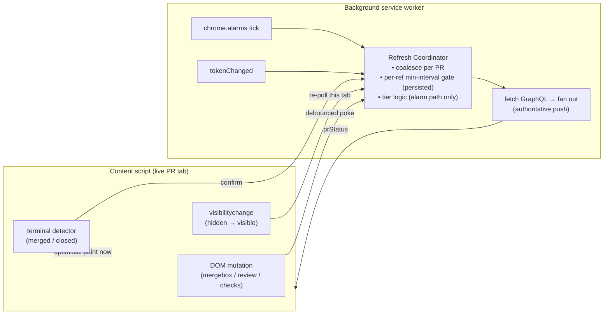

# Signal-Driven PR Status Refresh

## Problem Frame

Floodgate's PR-status favicon only updates on one trigger: the central
`chrome.alarms` poll, fixed at `periodInMinutes: 1` ([background/index.ts:442](../../background/index.ts)).
MV3 clamps alarms to a 1-minute floor, so the favicon reacts to a merge,
approval, or check completion **up to ~60s late** on the fast tier, and up to
~5 minutes late on the slow tier (approved + passing, [poll-policy.ts:6](../../lib/poll-policy.ts)).

For the PR tab the user is **actively looking at**, this lag is the most
noticeable: they watch the page show "merged" while the favicon still reads
"open" for the better part of a minute. Meanwhile the page itself already knows
— GitHub re-renders the mergebox the instant state changes — and the extension
already runs a `MutationObserver` on that page, but it only uses it to defend
its own favicon against GitHub's overwrites ([github-pr-favicon.ts:37](../../contents/github-pr-favicon.ts)).
It ignores the mergebox, review, and checks DOM entirely.

Worse, two existing "signals" that _could_ drive a fast refresh don't:
`visibilitychange` is reported to the background but only updates unread-latch
bookkeeping — it never re-polls the now-visible tab ([background/index.ts:404](../../background/index.ts)).
Triggers are scattered across the codebase (alarm listener, `tokenChanged`
handler, `registerPr` handler) with no shared notion of "request a refresh,"
so adding a new trigger today means hand-wiring another call into `pollAll`.

This work adds DOM mutation as a new, fast signal **and** refactors those
scattered triggers behind a single "request a refresh" entry point. The
justification is that present-day pain (every new trigger hand-wires into
`pollAll`), with smooth future-signal integration as a bonus, not the rationale.

A caveat worth stating plainly: the ~60s active-tab lag is a self-observed
annoyance, not a reported pain, and there is an inversion — the favicon matters
most for tabs the user is _not_ looking at, while a DOM signal only fires on the
attended tab, where the page already shows the truth. So the active-tab terminal
paint is partly polish. The durable correctness wins are the **visibility
re-poll** (a stale background tab becomes current the instant it's focused) and
faster catch-up on review/check changes; the instant terminal paint is the cherry
on top, not the core value.

## Architecture Direction

All refresh triggers funnel through one background-side coordinator. The
GraphQL API stays the source of truth; signals decide **when** to fetch, not
**what** the status is — with one narrow exception (the optimistic terminal
paint, R6).

## Requirements

**Refresh coordinator (the refactor)**

- R1. Introduce a single background-side entry point — conceptually
  `requestRefresh({ ref?, tabId?, reason })` — that every refresh trigger calls.
  The alarm tick, `tokenChanged`, `registerPr`, and the two new signals all
  route through it instead of calling fetch logic directly.
- R2. The coordinator decides whether and when to actually fetch: it coalesces
  concurrent requests for the same PR ref (one in-flight fetch fanned out to all
  tabs showing it, preserving today's by-ref dedup) and enforces a per-ref
  minimum interval between signal-triggered fetches (R10).
- R3. The existing tiered cadence (`pollTier` / `isPollDue`, fast/slow/stop)
  continues to govern the **alarm** path only. Signal-triggered refreshes force
  a fetch regardless of tier (subject to R10) — a signal means "this specific PR
  changed now," which is exactly when the tier guard should be bypassed. (Open
  question: whether signals should also bypass the `stop` tier — see Outstanding
  Questions.)

**DOM-mutation signal**

- R4. On a live PR tab, observe the mergebox / review / checks region for
  mutations and, on change, emit a debounced "this PR may have changed" signal
  to the coordinator. The signal is a **poke only** — it carries no parsed
  review/check values, so a misread never produces a wrong favicon. Scope the
  observed subtree to the mergebox + review/check summary nodes — **not** the
  streaming timeline / CI-log region — so a busy page does not emit continuous
  pokes (R10 still bounds the fetch rate, but narrow scoping keeps a settled PR
  from churning the signal path in the first place).
- R5. The observer must find the mergebox region when present and survive
  Turbo soft-navigation between a PR's sub-tabs (Conversation / Files / Checks),
  re-establishing as needed. When the region is absent (e.g. a sub-tab without a
  mergebox), the signal simply doesn't fire.
- R6. **Hybrid terminal fast-path:** when the DOM unambiguously shows a terminal
  state (merged or closed), the content script optimistically paints that
  favicon immediately (purple / solid-red whole icon), then still emits a
  confirming signal so the coordinator's fetch reconciles the authoritative
  state and updates the registry + unread latch normally. Define the reconcile
  for the unhappy paths so the paint cannot strand a wrong favicon: if the
  confirming fetch **disagrees**, the authoritative push wins; if it **errors or
  never lands** (no token, rate-limit, network), revert to the last authoritative
  favicon (or a pending state) after a bounded wait rather than leaving the
  optimistic paint uncorrected.
- R7. Terminal detection uses GitHub's **stable** hooks only —
  `data-testid="mergebox-partial"`, `aria-label="Merged"` / `aria-label="Closed"`,
  and the Octicon class (`octicon-git-merge` / closed-PR icon) — never the
  content-hashed CSS-module class names (`MergeBox-module__…`), which rotate per
  deploy.

**Visibility re-poll signal**

- R8. When a hidden PR tab becomes visible, the content script requests a
  refresh of that tab through the coordinator (in addition to today's latch
  bookkeeping), so a focused tab shows current status instead of waiting for the
  next alarm tick.
- R9. The visibility re-poll is gated by the same per-ref min-interval (R10);
  re-visiting the _same_ tab within the interval cannot re-fetch. Note this
  per-ref gate does **not** bound the aggregate across _distinct_ PRs: cycling N
  pinned PR tabs fires up to N fetches in a burst. A short global debounce (or
  "fetch on settle, not on every transition") bounds that burst — see R10.

**Rate-limit & robustness guardrails**

- R10. A per-ref minimum interval bounds signal-triggered fetches (alarm-driven
  fetches are unaffected); even on a chatty page (streaming CI logs, comments
  loading) a single PR cannot be signal-fetched more often than this interval.
  The interval's timestamp is **persisted to `chrome.storage.session`** (the way
  the registry / `lastPolledAt` already are) and read before deciding to fetch,
  so an MV3 service-worker eviction (~30s idle) cannot reset the guard and let a
  post-respawn poke storm bypass it. A short global debounce additionally bounds
  the cross-PR aggregate (R9), and the interval may be tier-aware (longer for
  settled / slow-tier PRs) so a chatty settled PR does not silently jump to the
  fast-tier fetch rate.
- R11. The feature degrades safely: if GitHub's DOM changes so the observer or
  terminal detector finds nothing, the extension silently falls back to today's
  poll-only behavior. No thrown errors, no broken favicon. Because that
  degradation is silent, emit a lightweight self-check (e.g. log once when the
  observer finds no mergebox region on a known PR page) so the maintainer can
  detect that the optimization quietly turned off — rather than rediscovering the
  60s lag by accident months later.
- R12. DOM signals are a **foreground-latency optimization** layered on top of
  the central poll, not a replacement. Background / discarded tabs (no live
  content script) remain covered by the alarm poll exactly as today.

## Success Criteria

- On the active PR tab, a merge or close is reflected in the favicon within
  ~1–2s (optimistic paint), versus up to 60s today.
- On the active PR tab, a review submission or check completion is reflected
  within a few seconds (debounced poke → confirming fetch), versus up to 60s.
- Switching to a previously-hidden PR tab shows current status promptly instead
  of stale-until-next-tick.
- No single PR is signal-fetched more often than the per-ref min-interval, the
  guard survives a service-worker eviction, and the cross-PR aggregate (many
  pinned tabs becoming visible) stays comfortably within the GraphQL budget.
- With GitHub's mergebox markup changed/removed, the extension still works at
  today's poll cadence with no console errors, and the self-check (R11) makes
  the silent fallback observable.
- Existing `lib/` tests pass; new pure logic (coordinator gating decision,
  terminal DOM detection) is unit-tested.

## Scope Boundaries

- **Not** full DOM inference of review/check state (the rejected "Full DOM
  inference" option) — only the narrow merged/closed terminal paint is read from
  the DOM; everything else is a trigger.
- **Not** a replacement for the central alarm poll; background/discarded tabs
  stay poll-covered (R12).
- **Not** tapping GitHub's live-updates SSE / socket channel, nor `webRequest`
  interception of GitHub's own API traffic — noted as possible _future_ signals
  the coordinator could accept, explicitly out of scope here.
- **Not** changing the favicon visual model, the unread-latch semantics, the
  watched-repos feature, or box-select.
- Event-driven SPA-nav (replacing the `setInterval(onNav, 1000)` URL poll with
  Turbo / `pushState` events) was considered as a third source and deferred — a
  good future coordinator client, but it touches the load-bearing nav path and
  isn't needed for this iteration's latency goal.

## Key Decisions

- **Hybrid signal semantics (trigger-only + terminal fast-path):** chosen over
  pure trigger-only and over full DOM inference. Terminal states are unambiguous
  in the DOM and the most satisfying to update instantly; everything else stays
  API-truth to avoid coupling the favicon to GitHub's volatile markup.
- **Two sources this iteration (DOM mutation + visibility re-poll):** the
  refactor is justified by today's pain — triggers scattered across the alarm,
  `tokenChanged`, and `registerPr` paths with no shared "request a refresh" — not
  by validating an abstraction for its own sake. Keep the coordinator minimal: if
  a `Map<ref, lastSignalFetchedAt>` cooldown read at the two new call sites
  captures the benefit, prefer that over a heavier layer, and grow it only when a
  third signal actually materializes. Visibility re-poll is high-value on its own.
- **Coordinator lives in the background:** it owns the token, the tab registry,
  rate-limit awareness, and the by-ref fan-out — the only place that can gate and
  coalesce fetches across all tabs.
- **Signals force fetches past the tier guard but never past the min-interval:**
  tier logic exists to throttle _blind_ polling; a signal is evidence of an
  actual change, so it should win against the tier but still respect the
  rate-limit floor.

## Dependencies / Assumptions

- Assumes GitHub keeps `data-testid="mergebox-partial"` and the `aria-label` /
  Octicon hooks reasonably stable; R11 makes a wrong assumption degrade
  gracefully (and now observably) rather than break.
- Assumes the active tab's content script is alive when state changes (true for
  a tab the user is viewing); background coverage is unchanged (R12).
- Builds on the existing by-ref coalescing, registry, and `onPoll` latch logic —
  the coordinator wraps these, it does not rewrite them.

## Outstanding Questions

### Resolve Before Planning

_(none — the two core product decisions are settled; the scope tradeoffs below
are carried into planning but do not block it.)_

### Deferred to Planning

- [Affects R4, R10][Technical] Exact debounce and min-interval values.
  Recommend ~300ms content-side debounce on DOM mutations and a ~10s per-ref
  background min-interval (≤6 signal fetches/min/PR worst case) — confirm during
  planning against the GraphQL budget, including the cross-PR burst (R9).
- [Affects R5, R7][Needs research] The most durable anchor for the mergebox
  observer across PR sub-tabs and GitHub deploys — which stable container to
  observe, and the exact stable selectors for merged vs. closed.
- [Affects R1, R2][Technical] The concrete coordinator API and how it composes
  with the existing `pollAll` / `fetchAndPushRef` / `isPollDue` code without
  duplicating the by-ref dedup already in `pollAll`.
- [Affects R6][Technical] Whether the optimistic terminal paint stays
  client-only until the confirming fetch lands, or also short-circuits the
  registry status (recommend client-only; let the confirming fetch own the
  registry + latch to avoid two writers).
- [Affects scope][Product] Sequence decision: ship the visibility re-poll (plus
  the minimal trigger funnel it needs) first and measure whether the active-tab
  lag complaint is substantially resolved, before committing to the DOM-mutation
  observer (R4–R7), which carries the bulk of the build cost and the ongoing
  DOM-selector upkeep.
- [Affects R6, R7][Scope] Descope the optimistic terminal paint if a debounced
  poke → confirming fetch already meets the ~1–2s criterion — the paint buys
  sub-second latency at the cost of a second favicon writer plus DOM coupling.
- [Affects R3][Technical] Should signals also bypass the `stop` tier? merged /
  closed are absorbing states, so a late mutation on a stopped PR would force a
  fetch on something the system deliberately retired — likely suppress the signal
  path for stop-tier refs.
- [Affects R8][Technical] Does R8 reuse the existing `visibility` message
  (extending `handleVisibility`) or add a new coordinator message, and is the
  re-poll a no-op when `getToken()` is null (mirroring `pollAll`'s early return)?
- [Affects R4, R5][Technical] The new mergebox observer's lifecycle vs. the
  existing `<head>` favicon observer, which is torn down per sub-tab nav today —
  R5's "survive Turbo nav" conflicts with the current observe-then-disconnect
  pattern; decide whether it attaches to the existing `register()` / teardown
  lifecycle or runs independently.

## Next Steps

-> `/ce-plan` for structured implementation planning
