# feat: PR unread indicator — dot for changes while backgrounded

## Overview

Add an **unread indicator** to the existing PR status favicon: a dot in the favicon's
top-right corner that lights when a PR tab's favicon *visibly changes while the tab is
backgrounded*, and clears when you bring the tab back to the foreground. The same unread
state surfaces on the Options "Currently monitoring" list. The point: across a box-selected
stack of PR tabs, the color tells you each PR's *current* state, but not *which ones moved
since you last looked* — the dot closes that gap.

This builds entirely on the PR status favicon feature (`2026-06-09-pr-status-favicon`):
the background registry + `chrome.alarms` poll, the content-script favicon renderer, the
status model, and the Options list. No new permissions.

## Problem Frame

A favicon that turned green an hour ago and one that turned green ten seconds ago look
identical. After boxing a PR stack and backgrounding those tabs, you re-scan every icon and
still can't tell what's new. The unread dot marks the tabs whose rendered favicon changed
while you weren't looking at them. (See origin: `docs/brainstorms/2026-06-10-pr-unread-indicator-requirements.md`.)

**Framing note (resolved in planning):** the signal is "changed while this tab was
**backgrounded**" (you switched to another tab, or minimized the window) — *not* "while you
walked away from the computer." If the PR tab stays the foreground tab while you alt-tab to
another app, Page Visibility still reports `visible` and no dot lights. Window/app-level blur
detection is deferred to v2.

## Requirements Trace

Carried from the origin doc's `U#` requirements (the `U#` IDs are the contract; this plan
implements them):

- **U1** — content script is the visibility source of truth (Page Visibility API), reports
  transitions + initial visibility to the background. → Unit 7
- **U1a** — background does not reconstruct focus (`chrome.windows.onFocusChanged` /
  `chrome.tabs.onActivated`); it consumes the content script's `visibility` message. → Unit 6
- **U1b** — window/app-level blur is out of scope for v1. → Unit 7
- **U2** — registry entry carries `seenStatus`, `visible`, `unread`; persisted in
  `chrome.storage.session`; survives SW eviction. → Units 3, 6
- **U3** — baseline set on first fetch regardless of visibility (never-seen tab shows no dot
  until it changes; dot means "changed since auto-open"). → Unit 5
- **U4 / U4a** — latch on a *visible favicon change* while hidden; "differs" measured via a
  defined `FaviconSpec` equality (not raw status, not `JSON.stringify`). → Units 1, 5
- **U5** — on become-visible: clear `unread`, re-baseline `seenStatus = currentStatus`, redraw.
  → Units 5, 6, 7
- **U6** — **dropped in planning** (redundant; see Key Technical Decisions). Baseline advances
  on register, on poll-while-visible, and on become-visible only.
- **U7 / U7a / U7b** — dot rendered top-right on both the split and `whole` favicon paths;
  passed as a separate draw arg (not a `FaviconSpec` field); hue orthogonal to the 5 status
  colors; background owns `unread`; content may optimistically clear on become-visible. → Units 2, 6, 7
- **U8 / U8a / U8c** — Options "Currently monitoring" row shows unread (OR across the PR's tabs)
  + header count copy + pending/error row states; live via `storage.onChanged`. → Units 3, 8
- **U8b** — opening a PR from the list clears its unread. No dedicated logic: opening focuses
  the tab → its content script reports `visible` → U5 clears the latch. → Units 6, 7 (via U5)
- **U9** — three-tier poll cadence: unsettled (fast ~60s) · settled-but-open (slow ~5 min) ·
  merged/closed (stop). Resolves the "settled PRs stop polling" P0. → Units 4, 6
- **U10** — failed redraw push must not prune the registry; `chrome.tabs.onRemoved` is the
  sole prune signal. Resolves the "prune drops the latch" P0. → Unit 6

## Scope Boundaries

- **Not a notification system** — no OS notifications, sound, or popups. Passive markers on the
  tab strip + Options list only.
- **No directional/severity styling** — one dot style for any visible change.
- **Favicon + Options list only** — no aggregate toolbar-action badge (the action badge is
  already per-tab-overloaded with box-select `ON` and token `!`).
- **github.com only**, single token, requires a loaded document — inherited from the favicon feature.

### Deferred to Separate Tasks

- **Window/app-level blur as "away"** (`document.hasFocus()` + window blur/focus, with
  devtools/omnibox noise suppression) — v2.
- **Survive Chrome tab-discard** — v2. Unread survives SW eviction (U2) but a discarded tab's
  content script dies and the tab re-baselines on restore; distinguishing discard-vs-close is
  out of v1.
- **"Mark all read"** affordance in the Options list — v2.
- **MV3 background/content/DOM integration test harness** — this repo unit-tests only `lib/`;
  adding a Chrome-API/DOM test harness is a separate infra task. This plan extracts the risky
  logic into pure `lib/` modules (Units 1, 4, 5) that *are* unit-tested, and verifies the glue
  (Units 6–8) via enumerated manual scenarios.

## Context & Research

### Relevant Code and Patterns

- `background/index.ts` — the central poll: `prRegistry` (Map mirrored to `storage.session` via
  `persistRegistry`), `pollAll` (skips `entry.settled`), `reconcilePollAlarm` (clears the alarm
  when `!hasUnsettled`), `fetchAndPushRef` (fetch → fan out via `pushToTab`), `handleRegisterPr`,
  `pushToTab` (**deletes the entry on a failed `sendMessage`** — changed by U10),
  `chrome.tabs.onRemoved → unregister` (the authoritative prune), and the `onMessage` router.
- `contents/github-pr-favicon.ts` — owns the favicon DOM: `applyFavicon`/`drawStatus`, the
  `<head>` MutationObserver re-assert, the `chrome.runtime.onMessage` handler for `prStatus` /
  `prError` / `restoreFavicon`, the Turbo soft-nav `onNav` loop, and `register`/`teardownToOriginal`.
- `lib/favicon.ts` — `drawFavicon` (canvas; **`whole` branch returns early**), `faviconSvg`
  (SVG string; shares `geometry()`), `STATUS_HEX`. The shared `geometry()` is where the dot anchor goes.
- `lib/pr-status.ts` — `PrStatus`, `FaviconSpec` (optional `plus?`/`whole?`), `toFaviconSpec`,
  `isSettled`. Equality helper lands here.
- `lib/registry.ts` — `RegistryEntry { ref, settled, status?, error? }` + `REGISTRY_KEY`.
- `lib/messages.ts` — message/command types (`registerPr`, `prStatus`, `prError`, etc.).
- `options.tsx` — `MonitoredPrs` reads the registry from `storage.session`, subscribes to
  `storage.onChanged`, `coalesce()` collapses per-tab entries into one row per PR, `statusText()`.

### Institutional Learnings

- None — repo has no `docs/solutions/` directory.

### External References

- None used — standard MV3 + the Page Visibility API on patterns already established in-repo.
- Page Visibility: `document.visibilityState` is `hidden` when the tab is not the active tab of
  its window **or** the window is minimized; it stays `visible` under occlusion / OS window blur
  (this is exactly why U1b scopes to "backgrounded," not "walked away").

## Key Technical Decisions

- **Latch state machine extracted to a pure `lib/unread.ts`** — the reviewers' hardest findings
  were all in the latch transitions (baseline timing, flap, never-viewed, focus-clear). Putting
  the transition logic in a pure, heavily unit-tested module is the single highest-leverage
  correctness move and matches the repo convention (only `lib/` is tested).
- **`FaviconSpec` equality is a defined function, and `unread` is NOT a `FaviconSpec` field** —
  `FaviconSpec` has optional `plus?`/`whole?`, so `===`/`JSON.stringify` are unreliable. Define
  `faviconSpecEqual(a, b)` in `lib/pr-status.ts` and pass `unread` as a separate draw argument so
  the equality surface used by the latch stays clean.
- **Drop U6 (re-baseline on hide)** — while a tab is visible, every poll sets `seenStatus =
  newStatus`, so at the moment it goes hidden `seenStatus` already equals the current status.
  Re-baselining on hide is redundant and reintroduces the hide-window race. Baseline advances on
  register (U3), poll-while-visible (U4 visible branch), and become-visible (U5) only.
- **Three-tier poll cadence (U9)** — merged/closed **stop**; **only approved+passing** (the one
  open state where nothing actionable is pending) goes **slow**; **everything else open stays
  fast** — including `changes-requested`, so an author's fix-push while you're away is detected
  promptly (the `+` / re-run is exactly the high-value transition). Do **not** reuse `isSettled`
  for the slow/fast split (it treats `changes` as terminal, which would wrongly demote it); define
  `pollTier` to test `review === "approved" && check === "success"` for the slow tier directly.
  Implemented by tracking `lastPolledAt` per entry against the existing ~60s alarm floor, gated by
  a pure decision function (testable; survives SW eviction via the registry).
- **`onRemoved` is the only prune (U10)** — stop deleting the entry inside the push-failure path;
  a rejected `sendMessage` means "couldn't redraw now," not "gone." Closed tabs / SPA-nav already
  clean up via `onRemoved` / `unregisterPr`.
- **Races resolved without sequence numbers** — the SW runs single-threaded and each listener runs
  to completion; the async gaps are the `await fetchPrStatus` and the per-tab `await setErrorBadge`
  inside `fetchAndPushRef`. Two guards close the windows: (1) re-read `entry.visible` from the
  registry **per tab, immediately before** that tab's `onPoll` (not once for the whole ref
  fan-out), so visibility messages landing during inter-tab awaits are respected; (2) after the
  fetch, **verify the entry's `ref` still matches the ref this fetch was issued for** (`refKey`) —
  a PR-A→PR-B SPA-nav can re-register the same `tabId` mid-fetch, and with the U10 prune removed
  nothing else self-corrects, so a stale A-result must be **skipped** (no latch, no push) rather
  than painted onto B. Both guards live in Unit 6 and are stated as explicit invariants.
- **Undefined baseline is "set, don't latch"** — `entry.status`/`seenStatus` are absent until the
  first *successful* fetch (no token, or first fetch errored). Never pass `undefined` to
  `toFaviconSpec`: `onPoll` with `seenStatus === undefined` sets the baseline and does **not**
  latch; `onVisibilityChange→visible` clears `unread` but only re-baselines when `entry.status` is
  defined (and skips the redraw push when there's no status, or pushes `"fetching"`).
- **Retire `entry.settled`** — U9 makes "settled" no longer mean "stop polling," so the field's
  JSDoc ("polling stops when settled") is now false. Remove `settled` from `RegistryEntry` and
  derive the poll decision from `pollTier(entry.status)` at read time, eliminating a zombie field
  that would otherwise persist a misleading value to `storage.session`.
- **Errors don't latch** — a `prError` poll outcome leaves `seenStatus` and `unread` untouched
  (the error badge + Options "couldn't fetch" already surface it); only successful status changes
  drive the latch.
- **Background owns `unread`; content optimistically clears** — the content script may clear its
  own dot instantly on become-visible to hide round-trip lag, but holds no latch state; the
  background's U5 push is authoritative and idempotent.

## Open Questions

### Resolved During Planning

- "Walk away" vs Page-Visibility mechanism → reframe to "backgrounded"; window-blur is v2.
- Lifecycle (merged/closed) dot → **show it** (the dot draws on the `whole` path too).
- Multi-tab latch → store `unread` per tab; focusing any tab of a PR clears the latch on **all**
  coalesced tabs of that PR (so the Options row clears live, satisfying the success criterion).
- Never-viewed boxed tab → dot means "changed since auto-open"; intended.
- Error + unread Options row → render both (error text/color **and** the dot).
- U6 re-baseline-on-hide → dropped (redundant).
- Robust multi-surface tier → confirmed in brainstorm; not re-litigated.

### Deferred to Implementation

- Exact dot pixel size / ring weight at 16px and 32px — design detail, prototyped during Unit 2
  against all five half-colors and the "+". Constraint is locked (orthogonal hue, top-right,
  clear of the "+"); the exact geometry is not.
- Exact slow-tier interval constant (~5 min) and whether it's expressed as a tick-multiple or a
  `lastPolledAt` delta — settle in Unit 4 against the existing alarm floor.
- Final Options header copy string and whether unread rows sort to the top (the latter stays a
  deferred enhancement; v1 keeps the existing alpha sort).

## High-Level Technical Design

> *This illustrates the intended approach and is directional guidance for review, not
> implementation specification. The implementing agent should treat it as context, not code to
> reproduce.*

**Unread latch — per-tab state transitions** (lives in `lib/unread.ts`, driven by the background):

```mermaid
stateDiagram-v2
    [*] --> Seen: register(firstStatus, visible?)\nseenStatus = firstStatus, unread = false
    Seen --> Seen: poll while VISIBLE\nseenStatus = newStatus (you saw it)
    Seen --> Unread: poll while HIDDEN\n& faviconSpec(newStatus) != faviconSpec(seenStatus)\nunread = true (latch)
    Unread --> Unread: poll while HIDDEN\n(latched; stays lit even if it flaps back)
    Unread --> Seen: become VISIBLE\nseenStatus = currentStatus, unread = false
    Seen --> Seen: become VISIBLE\nseenStatus = currentStatus (no-op clear)
    note right of Unread
        Errors (prError) do not change
        seenStatus or unread.
    end note
```

**Poll cadence tiers** (decided by `lib/poll-policy.ts`, applied each ~60s alarm tick):

| PR state | Tier | Behavior |
|----------|------|----------|
| Open, anything pending **or** changes-requested | **fast** | poll every tick (~60s) |
| Open **and** approved + all checks passing (nothing actionable pending) | **slow** | poll if `now − lastPolledAt ≥ ~5 min` |
| `merged` / `closed` | **stop** | never poll; alarm cleared when no fast/slow entries remain |

## Implementation Units

- [x] **Unit 1: `FaviconSpec` equality primitive**

**Goal:** A defined, unit-tested equality for the latch's "did the rendered favicon change?" test.

**Requirements:** U4a

**Dependencies:** None

**Files:**
- Modify: `lib/pr-status.ts`
- Test: `lib/pr-status.test.ts`

**Approach:**
- Add `faviconSpecEqual(a: FaviconSpec, b: FaviconSpec): boolean`. Normalize the optional fields:
  when `a.whole || b.whole`, equality compares `whole` + `left` only (the right half and `plus`
  are not painted on a whole icon). Otherwise compare `left`, `right`, and `!!a.plus === !!b.plus`
  (treat `undefined` and `false` as equal).
- This is the **single source of "differs"** for U4 — Unit 5 compares `toFaviconSpec(newStatus)`
  against `toFaviconSpec(seenStatus)` through it.

**Patterns to follow:** existing pure exports + tests in `lib/pr-status.ts` / `lib/pr-status.test.ts`.

**Test scenarios:**
- Happy path: identical specs → `true`; differing `left` → `false`; differing `right` → `false`.
- Edge case: `{left:'red',right:'green'}` vs `{left:'red',right:'green',plus:undefined}` → `true`.
- Edge case: `plus:true` vs `plus:false`/absent → `false`.
- Edge case: `{whole:true,left:'purple',right:'purple'}` vs `{whole:true,left:'purple',right:'grey'}`
  → `true` (right ignored when whole).
- Edge case: whole vs non-whole with same `left`/`right` → `false`.
- Edge case (the flap): `toFaviconSpec` of a *failing* check differs from a *passing* one → `false`
  on the pair, confirming an intermediate failing state would latch.

**Verification:** new tests pass; the comparator is referenced only from `lib/unread.ts` (Unit 5).

- [x] **Unit 2: Favicon unread dot rendering**

**Goal:** Draw a top-right dot on both the split and `whole` favicons, in canvas and SVG, from a
separate `unread` argument.

**Requirements:** U7, U7a

**Dependencies:** None

**Files:**
- Modify: `lib/favicon.ts`
- Test: `lib/favicon.test.ts` (new)

**Approach:**
- Extend `geometry()` with a top-right dot anchor (center + radius + ring), derived as a fraction
  of `size` so 16px and 32px stay proportional. Keep it clear of the `plus` (which is low-left).
- Add an `unread` flag to both renderers — **a separate argument**, e.g.
  `drawFavicon(spec, size, opts?: { unread?: boolean })` and the SVG equivalent — *not* a field on
  `FaviconSpec` (keeps Unit 1's equality clean).
- Canvas: draw the dot **after** the split/`whole` fill — crucially, also before the `whole`
  branch's early `return`, so merged/closed icons get the dot.
- SVG: append the dot markup in both the split and `whole` bodies.
- **Clip consistency:** the canvas applies `ctx.clip()` (rounded-rect) before all drawing, so the
  canvas dot is always clipped; but the existing SVG renders the `plus` *outside* the
  `<g clip-path>` group. Treat the dot **identically in both** — render it inside the clip in both
  renderers and **inset it from the top-right corner** (inside the corner radius) so neither
  renderer crops it. This keeps the tab favicon (canvas) and the Options preview (SVG) pixel-consistent.
- Dot hue: a fixed accent **orthogonal to the five status colors** (green/amber/red/grey/purple),
  with a thin contrasting ring so it reads against any background. Exact value chosen here and
  validated at 16px (deferred detail), but must not be a status hue.

**Patterns to follow:** the existing `geometry()` discipline shared by `drawFavicon` + `faviconSvg`
and the `plus` rendering in both (`lib/favicon.ts`).

**Test scenarios:**
- Happy path: `faviconSvg(spec, size, {unread:true})` includes the dot markup; `{unread:false}`
  (and the no-opts call) omits it.
- Edge case: dot present on a split spec (`{left,right}`).
- Edge case: dot present on a `whole` spec (`{whole:true,...}`) — guards the early-return path.
- Edge case: dot markup does not replace/remove the `plus` markup when both unread and `plus` set.
- (Canvas `drawFavicon` returns a data URI — assert it returns a non-empty `data:image/png` string
  for the unread variants; pixel assertions are out of scope without a canvas harness.)

**Verification:** SVG tests pass; manual check at 16px/32px shows the dot legible on all five
half-colors and on a whole icon, not colliding with the "+".

- [x] **Unit 3: Registry shape + message types**

**Goal:** Carry unread state through the registry and the message contracts.

**Requirements:** U2, U8 (data shape), U1a (visibility message contract), U7b (push shape)

**Dependencies:** None

**Files:**
- Modify: `lib/registry.ts`
- Modify: `lib/messages.ts`
- Test: none directly (type/shape change; behavior tested in Units 5/6 logic and Unit 8)

**Approach:**
- `RegistryEntry` gains: `seenStatus?: PrStatus` (baseline), `visible?: boolean` (last reported),
  `unread?: boolean` (latch), `lastPolledAt?: number` (for Unit 4's cadence). Keep `status` as the
  latest fetched status (already present).
- **Remove `settled: boolean`** from `RegistryEntry` (its meaning is invalidated by U9 — see Key
  Technical Decisions). Unit 6 replaces its read/write sites with `pollTier(entry.status)`. This is
  a breaking shape change caught by `tsc` at every site.
- `lib/messages.ts`:
  - New content→background message `{ type: "visibility", visible: boolean }`.
  - Extend the `registerPr` request to carry initial `visible: boolean`.
  - Extend the `prStatus` command pushed to the content script with `unread: boolean`.

**Patterns to follow:** existing `RegistryEntry` JSDoc and the discriminated-union message types in
`lib/messages.ts`.

**Test scenarios:** `Test expectation: none` — pure type/shape additions; exercised by Units 5, 6, 8.

**Verification:** `tsc` clean; downstream units compile against the new shapes.

- [x] **Unit 4: Poll-cadence policy (U9)**

**Goal:** A pure decision function for the three-tier cadence, then wired into the background poll.

**Requirements:** U9

**Dependencies:** Unit 3

**Files:**
- Create: `lib/poll-policy.ts`
- Test: `lib/poll-policy.test.ts` (new)
- (Wiring into `background/index.ts` happens in Unit 6.)

**Approach:**
- `pollTier(status: PrStatus | undefined): "fast" | "slow" | "stop"` — `merged`/`closed` → `stop`;
  else **only** `review === "approved" && check === "success"` (open, nothing pending) → `slow`;
  else (incl. `changes-requested`, any pending, and no status yet) → `fast`. **Does not call
  `isSettled`** — `isSettled` treats `changes` as terminal, which would wrongly slow-tier a PR
  whose author is about to push a fix.
- `isPollDue(tier, lastPolledAt, now, slowIntervalMs): boolean` — `fast` → always; `slow` →
  `now - (lastPolledAt ?? 0) >= slowIntervalMs`; `stop` → never.
- `hasPollable(entries): boolean` — any entry whose tier ≠ `stop` (replaces `hasUnsettled` for
  alarm reconciliation, so the alarm stays alive for slow-tier PRs).

**Patterns to follow:** `isSettled` in `lib/pr-status.ts` (pure status predicate + tests).

**Test scenarios:**
- Happy path: pending check → `fast`; approved+passing (open) → `slow`; merged → `stop`; closed → `stop`.
- Edge case: `undefined` status (pre-first-fetch) → `fast`.
- Edge case (the changes-requested fix): changes-requested + failing (open) → **`fast`** (not slow);
  approved + pending → `fast`; approved + failing → `fast` (only approved+success is slow).
- `isPollDue`: fast always due; slow due only when `now - lastPolledAt ≥ interval`; slow with no
  `lastPolledAt` → due; stop never due.
- `hasPollable`: true when any fast/slow entry exists; false when all entries are stop (and false
  for an empty set).

**Verification:** tests pass; covers the post-settle detection case the P0 was about.

- [x] **Unit 5: Unread latch state machine (U3/U4/U5)**

**Goal:** The pure transition logic for the latch — the correctness core.

**Requirements:** U3, U4, U4a, U5

**Dependencies:** Units 1, 3

**Files:**
- Create: `lib/unread.ts`
- Test: `lib/unread.test.ts` (new)

**Approach:**
- Model transitions as pure functions over the unread-relevant slice of an entry
  (`{ seenStatus?, visible?, unread? }`) plus the latest status. Suggested shape (directional):
  - `onRegister(firstStatus, visible)` → `{ seenStatus: firstStatus, visible, unread: false }`.
  - `onPoll(prev, newStatus)` → if `prev.seenStatus === undefined`: `{ seenStatus: newStatus }`
    (seed baseline, **never latch** — a tab with no baseline yet just establishes one); else if
    `prev.visible`: `{ seenStatus: newStatus, unread: false }`; else if
    `!faviconSpecEqual(toFaviconSpec(newStatus), toFaviconSpec(prev.seenStatus))`:
    `{ unread: true }` (latch; `seenStatus` unchanged); else no change.
  - `onVisibilityChange(prev, currentStatus, becameVisible)` → on `becameVisible === true`:
    `{ visible: true, unread: false }` **and** `seenStatus: currentStatus` **only when
    `currentStatus` is defined** (if the tab has no status yet, clear `unread` and leave
    `seenStatus` unset so the next successful `onPoll` seeds it); on `false`: `{ visible: false }`
    only (**no re-baseline** — U6 dropped).
- **Never pass `undefined` to `toFaviconSpec`** — the guards above ensure the equality compare only
  runs once a real `seenStatus` exists (`toFaviconSpec` reads `.state` and would throw on
  `undefined`). This is the load-bearing invariant the reviewers flagged across feasibility/adversarial.
- Errors are simply *not routed* through `onPoll` (Unit 6 calls `onPoll` only on a successful
  fetch), so `seenStatus`/`unread` are inherently preserved across a `prError`.
- `seenStatus` is the baseline; the entry's existing `status` field remains the latest status and
  is what `onVisibilityChange` reads as `currentStatus`.

**Technical design:** see the state diagram in High-Level Technical Design.

**Test scenarios:**
- Happy path (never-viewed boxed tab): register hidden with status X (no dot); poll Y≠X while
  hidden → unread latches; "changed since auto-open" contract.
- Happy path (watched live): register visible with X; poll Y while visible → `seenStatus=Y`, no dot.
- Latch/flap: hidden, X→Y latches; Y→X while still hidden → **stays** unread (latched).
- Clear + re-baseline: latched, then become-visible → unread false, `seenStatus = currentStatus`;
  a subsequent hidden poll of the same status does **not** re-latch.
- Edge case (no visible change): hidden, status changes but `toFaviconSpec` equal (e.g. two states
  that render the same icon) → no latch.
- Edge case (drop-U6 correctness): visible with X (seenStatus tracks), go hidden (no re-baseline),
  poll Y → latches against X.
- Become-hidden never sets unread on its own.
- Edge case (undefined baseline — no token / first fetch errored): `seenStatus` undefined, `onPoll`
  with a real status → seeds `seenStatus`, **no latch**, never calls `toFaviconSpec(undefined)`.
- Edge case (become-visible with no status): `entry.status` undefined → `unread` cleared,
  `seenStatus` left unset (next successful `onPoll` seeds it).

**Verification:** tests pass, covering every reviewer-flagged edge (never-viewed, flap, focus-clear,
no-visible-change, dropped-U6).

- [x] **Unit 6: Background wiring**

**Goal:** Integrate the latch, the cadence, the visibility message, and the prune change into the
service worker.

**Requirements:** U1a, U2, U5, U7b, U9, U10

**Dependencies:** Units 3, 4, 5

**Files:**
- Modify: `background/index.ts`
- Test: none (MV3 SW glue — no harness; logic covered by Units 4, 5). Manual scenarios below.

**Approach:**
- **Visibility handler:** add a `visibility` branch to the `onMessage` router; on receipt, call
  `onVisibilityChange` for `sender.tab.id`'s entry, persist, and on become-visible push a redraw
  (`{ type: "prStatus", status: entry.status, unread: false }`) **only when `entry.status` is
  defined** — if the tab has no status yet, just persist the cleared `unread`/`visible` (the content
  script's optimistic clear already hid any dot; nothing to redraw). A `visibility` message for an
  unknown/unregistered tab is a no-op (dropped) — registration always reports initial visibility, so
  pre-register events aren't relied upon.
- **Register:** `handleRegisterPr` accepts the initial `visible`; seed the entry via `onRegister`
  with the first fetched status (or with `unread:false` and no `seenStatus` until the first fetch
  lands when there's no token yet).
- **Poll:** in `pollAll`, drive selection with `pollTier` + `isPollDue` (Unit 4) instead of the
  `entry.settled` skip (remove `entry.settled` reads/writes per Unit 3); a ref is selected if **any**
  of its tabs is due. In `fetchAndPushRef`, after the `await`, for **each** tab of the ref:
  - **Ref-match guard:** verify `refKey(entry.ref)` still equals the ref this fetch was issued for;
    if a PR-A→PR-B SPA-nav re-registered this `tabId` mid-fetch, **skip** it (no `onPoll`, no push) —
    the stale A-result must not paint onto B or latch a phantom dot.
  - Re-read the **current** `entry.visible` (per tab, here — not once for the whole fan-out, so
    visibility messages arriving during inter-tab `setErrorBadge` awaits are respected), run
    `onPoll`, persist, and push `{ type: "prStatus", status, unread: entry.unread }`.
  - Stamp `lastPolledAt = now` on **all** tabs of the fetched ref (not just the due one) so a PR's
    slow-tier cadence stays consistent across its tabs.
- **Alarm reconcile:** replace `hasUnsettled` with `hasPollable` so the alarm survives for slow-tier
  PRs and only clears when every entry is `stop` (or the registry is empty).
- **Prune (U10):** remove the `prRegistry.delete(tabId)` from `pushToTab`'s `.catch`; rely on the
  existing `chrome.tabs.onRemoved → unregister` and the `unregisterPr` message. (Optionally log/ignore.)
- Keep the existing token/error flows (`prError`, error badge, `tokenChanged`/`tokenCleared`) intact;
  ensure the new fields are included in `persistRegistry` round-trips (they're plain JSON).

**Patterns to follow:** the existing `onMessage` router, `fetchAndPushRef`/`pollAll`/`reconcilePollAlarm`,
and `persistRegistry` in `background/index.ts`.

**Test scenarios (manual / integration — no SW harness):**
- Integration: box a stack into background tabs → no dots initially; let a pending check finish →
  that tab's favicon gains a dot while backgrounded.
- Integration: focus a dotted tab → dot clears immediately; re-background it → no dot until it
  changes again.
- Integration (U9): approve+pass a PR (→ slow tier), then request changes while its tab is
  backgrounded → the PR flips back to fast tier and the dot appears within ~60s (polling did not stop).
- Integration (U10): background a dotted tab long enough to evict the SW, trigger a poll → the entry
  + dot persist (not pruned); close the tab → entry is removed (`onRemoved`).
- Integration (race — re-register): start a slow fetch on PR-A's tab, SPA-nav that tab to PR-B
  before the fetch resolves → the stale A-result is skipped (ref-match guard); B's favicon/dot are
  correct, no phantom dot.
- Integration (race — visibility): toggle a tab foreground/background around a poll → no stuck or
  incorrect dot (best-effort; not deterministically reproducible — the code invariants are the real
  guard, see Risks).

**Verification:** the manual scenarios hold; `tsc`/lint clean; no regression to box-select, token, or
the base favicon behavior.

- [x] **Unit 7: Content script — visibility reporting + dot draw**

**Goal:** Report visibility to the background and render the dot per the pushed `unread` flag.

**Requirements:** U1, U1b, U7, U7b

**Dependencies:** Units 2, 3

**Files:**
- Modify: `contents/github-pr-favicon.ts`
- Test: none (DOM/content glue — no harness). Manual scenarios below.

**Approach:**
- On `register`, send the initial `visible` (`document.visibilityState === "visible"`) in the
  `registerPr` message.
- Add a `visibilitychange` listener that posts `{ type: "visibility", visible }` to the background;
  remove it in `teardownToOriginal` / `pagehide` alongside the existing nav timer cleanup.
- The `prStatus` handler now carries `unread`; change `drawStatus(status, unread)` to pass it into
  `drawFavicon(spec, size, { unread })`. The **MutationObserver re-assert needs no change** — the
  dot is baked into the rendered PNG, so re-asserting the cached `lastDataUri` already preserves it
  across GitHub's icon rewrites. (Earlier framing was backwards: a `{spec, unread}` cache is *not*
  needed for re-assert.)
- Add module-level state `lastUnread: boolean` (and reuse the existing last-status to recompute the
  spec) **only** for the optimistic clear: on become-visible, redraw the *same* status with
  `unread: false` to drop the dot instantly. Without this the optimistic clear can't recompute a
  dot-less icon. Update `register`'s `drawStatus(res.status ?? "fetching")` and the `!lastDataUri`
  error path to pass `unread` through (default `false`).
- **Optimistic clear (U7b):** on `visibilitychange → visible`, immediately redraw without the dot
  (best-effort) in addition to posting the visibility message; the background's authoritative
  redraw push reconciles. Hold no latch state in the content script.

**Patterns to follow:** the existing `register` / `onMessage` / `teardownToOriginal` / `pagehide`
lifecycle and the `applyFavicon`/`drawStatus` + MutationObserver re-assert in
`contents/github-pr-favicon.ts`.

**Test scenarios (manual / integration):**
- Integration: backgrounding the tab and a background status change → dot appears on the tab strip.
- Integration: GitHub/Turbo rewrites the favicon while unread → the dot survives the re-assert.
- Integration: focusing the tab → dot clears instantly (optimistic), stays cleared after the
  background push.
- Integration: SPA-nav away from the PR → favicon restored, visibility listener torn down, no errors.

**Verification:** manual scenarios hold; no console errors; base favicon/title behavior unchanged.

- [x] **Unit 8: Options "Currently monitoring" unread surface**

**Goal:** Surface unread on the Options list — per-PR dot, header count, and row states.

**Requirements:** U8, U8a, U8c

**Dependencies:** Units 2, 3

**Files:**
- Modify: `options.tsx`
- Test: none (React/DOM glue — no harness). Manual scenarios below.

**Approach:**
- Extend `MonitoredItem` with `unread: boolean`; in `coalesce`, OR `entry.unread` across the PR's
  tabs (alongside the existing `error` OR).
- Render the dot on the row — reuse the favicon `unread` rendering (the row already shows
  `svgSrc(toFaviconSpec(status))`; pass `{ unread }` to `faviconSvg` so the row icon matches the tab).
- Header count: append "· N with updates" when N>0, "· 1 update" for N=1, and omit the suffix when
  N=0 (count = rows with `unread`).
- Row states (U8c): a row with no status yet → no dot + "Awaiting status…"; a row that is both
  `error` and `unread` → show the error text/color **and** the dot.
- Live updates already work via the existing `storage.onChanged` subscription.
- **U8b** needs no Unit-8 logic: opening a PR from the list focuses that tab → its content script
  reports `visible` → U5 (Units 6/7) clears the latch → the registry write fans back to this list
  via `storage.onChanged`. Verify the clear-on-open behavior, but implement nothing extra here.

**Patterns to follow:** `coalesce` / `MonitoredItem` / `MonitoredPrs` / `statusText` / `svgSrc` in
`options.tsx`.

**Test scenarios (manual / integration):**
- Integration: a backgrounded PR latches a dot → its Options row shows the dot and the header count
  increments, live (no reload).
- Integration: focus that PR's tab → row dot clears live and the header count decrements.
- Integration (multi-tab): PR open in 2 tabs, one latched → row unread; focusing either tab clears
  the row (per the per-PR clear decision).
- Edge case: 0 unread → header has no suffix; exactly 1 → "· 1 update".
- Edge case: error + unread row renders both signals; awaiting-status row shows no dot.

**Verification:** manual scenarios hold; the list still renders monitored PRs as before when nothing
is unread.

## System-Wide Impact

- **Interaction graph:** the `chrome.runtime` message channel is shared with the box-select content
  script; the new `visibility` message must be ignored by box-select's handler (each `onMessage`
  listener already returns false for types it doesn't own — preserve that). The background poll,
  the content favicon renderer, and the Options list all read/write the same `storage.session`
  registry.
- **Error propagation:** `prError` poll outcomes deliberately bypass the latch (no `seenStatus`/`unread`
  change); the existing auth-error badge and Options "couldn't fetch" remain the error surface.
- **State lifecycle risks:** the prune change (U10) means entries persist until `onRemoved`; confirm
  `unregisterPr` (SPA-nav off a PR) and `tokenCleared` still clear entries so the registry doesn't
  accumulate stale rows. New fields must round-trip through `persistRegistry` (plain JSON — fine).
- **API surface parity:** the dot lives in the shared `geometry()` so canvas (tab favicon), SVG
  (Options legend + monitored list) all render consistently; the Options legend may optionally gain
  an "unread" example (nice-to-have, not required).
- **Integration coverage:** the cross-layer behaviors (background latch → content draw → Options row,
  and the visibility round-trip) are verified manually per Units 6–8, since the repo has no MV3
  integration harness; the pure decision logic underneath is unit-tested (Units 1, 4, 5).
- **Unchanged invariants:** box-select activation, the token storage/confinement model, the base
  review/check favicon encoding, and the title-prefix feature are unchanged. The favicon's visual
  language gains exactly one additive element (the corner dot); the split/whole/“+” semantics are
  untouched.

## Risks & Dependencies

| Risk | Mitigation |
|------|------------|
| Slow-tier polling raises GitHub rate-limit use for long-open stacks | ~5 min tier (vs 60s) + existing per-PR coalescing (R10) + jitter; only approved+passing open PRs are slow, merged/closed stop. |
| **Slow-tier detection latency (residual, accepted)** — an approved+passing PR that changes while you're away is detected with up to ~5 min lag, so the "exactly the PRs that changed" criterion is *eventually* consistent for that one state | Accepted for v1; narrowing slow-tier to approved+passing only keeps the high-churn states (pending, changes-requested) fast; note the latency in the README so it's not read as instantaneous. |
| Dot illegible or color-confusable at 16px on some half-colors | Locked constraint (orthogonal hue + contrasting ring, top-right, clear of "+"); prototype at 16px/32px in Unit 2 against all five colors before finalizing. |
| Removing the push-failure prune leaks stale entries for crashed/discarded-but-open tabs (and they keep polling) | `onRemoved` cleans on actual close; footprint is tiny. Optionally mark `discarded` tabs as stop-tier via `chrome.tabs.onUpdated` so the leak doesn't amplify rate-limit (noted in Unit 6; full discard-survival is v2). |
| Visibility/poll & poll/re-register ordering | Single-threaded SW + **per-tab** `entry.visible` re-read before each `onPoll` + **ref-match guard** after the fetch (skip stale results when the tab re-registered to another PR). Documented as explicit Unit 6 invariants. |
| Race correctness can't be proven by manual scenarios | The race-sensitive logic is pushed into defensive *invariants in code* (ref-match skip, per-tab visible read, undefined-baseline guard) rather than relying on timing; the pure transition functions are unit-tested (Units 1, 4, 5). MV3 integration harness is explicitly deferred. |
| MutationObserver re-assert | No risk — the dot is baked into the rendered PNG, so re-asserting `lastDataUri` preserves it; no change needed to the re-assert path (Unit 7). |

## Documentation / Operational Notes

- Update `README.md` to mention the unread dot briefly (one line under the favicon description),
  including the honest framing: the dot marks changes while a tab was **backgrounded** (not
  "while away from the computer"), and approved+passing PRs are re-checked on a slower (~5 min)
  cadence so a change to one of them may take a few minutes to surface.
- Optionally extend the Options `FaviconLegend` with an unread-dot example so the legend documents
  the full visual language (nice-to-have).
- No migration / rollout concerns — `storage.session` is ephemeral; new fields default to absent and
  are seeded on the next register/poll.

## Sources & References

- **Origin document:** [docs/brainstorms/2026-06-10-pr-unread-indicator-requirements.md](docs/brainstorms/2026-06-10-pr-unread-indicator-requirements.md)
- Builds on: [docs/brainstorms/2026-06-09-pr-status-favicon-requirements.md](docs/brainstorms/2026-06-09-pr-status-favicon-requirements.md), [docs/plans/2026-06-09-002-feat-pr-status-favicon-plan.md](docs/plans/2026-06-09-002-feat-pr-status-favicon-plan.md)
- Related code: `background/index.ts`, `contents/github-pr-favicon.ts`, `lib/favicon.ts`, `lib/pr-status.ts`, `lib/registry.ts`, `lib/messages.ts`, `options.tsx`
