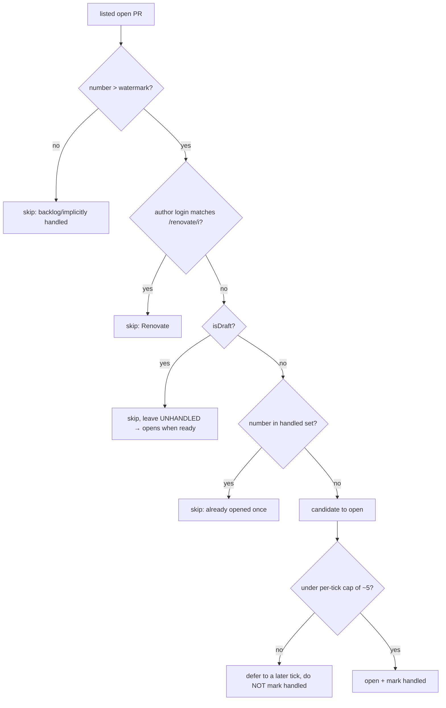

# feat: Watched repositories — auto-open new PRs in a Primary Window

## Overview

Let the user mark GitHub repos as **watched**. The background poller lists each watched repo's open
PRs on the existing ~60s alarm tick; a PR **opened after the repo was added** (and not a Renovate
bot PR, and not a draft) is auto-opened as an **inactive** tab in a designated **Primary Window**
(or, if none, the last-focused normal window) — never stealing focus. Opened tabs are ordinary PR
tabs, so they inherit auto-pin, dedup, the status favicon, and the unread dot.

This is a new acquisition layer on the existing background poller. It composes with everything built
this session (favicon, unread indicator, auto-pin/dedup).

## Problem Frame

For repos you actively review, you want new PRs to **show up on their own** — a passive review queue
in one window — without interrupting work in another window. Today every PR must be opened by hand.
(See origin: `docs/brainstorms/2026-06-11-watched-repos-auto-open-requirements.md`.) The brainstorm
explicitly owns the **deliberate inbox direction**: auto-opening tabs is the passive delivery
channel; the prior "not a notification system" line is reframed as "no _interruptive_ notifications."

## Requirements Trace

Carries the origin doc's `W#` contract (the `W#` IDs are authoritative):

- **W1** — Options list to add/remove watched `owner/repo`; persisted in `chrome.storage.local`. → Units 3, 4, 6
- **W2** — Only-after-add watermark = **highest existing open-PR number** at add-time; open only `number > watermark` (PR-number, not clock — avoids skew). → Units 1, 4
- **W3** — Token-gated; inert with no token. → Units 4, 5
- **W4 / W4a** — Per-tick list of each repo's open PRs (`number, author.login, isDraft, title`; `first:~30` desc), per-repo error isolation; **alarm stays alive when (watched repos AND token)** even with zero PR tabs. → Units 2, 5
- **W5 / W5a** — Skip Renovate (login `/renovate/i`); skip drafts until ready (leave unhandled). → Unit 1
- **W6** — Open-once: persisted per-repo handled set of opened PR numbers in `storage.local`; ≤ watermark implicit. Strict (no re-surface on new commits in v1). → Units 1, 5
- **W7** — Don't duplicate an already-open PR — scan via `chrome.tabs.query` across windows (+ `parsePrUrl`), plus an in-tick in-memory guard; an already-open skip is **not** recorded as handled. → Unit 5
- **W8 / W8a / W8b** — Open in Primary Window (validated) else last-focused normal window; always `active: false`; per-tick cap **~5**. Focus discipline for cross-window create is an assumption to verify. → Unit 5
- **W9** — Opened tabs compose with auto-pin/dedup/favicon/unread (no special unread treatment). → Unit 5 (emergent; no new code)
- **W10** — Options Primary Window control + state display; `primaryWindowId` in `storage.session` (recycle-safe; see Key Decisions), validated via `chrome.windows.get` for same-session closure. → Units 3, 4, 6
- **W11** — Restart readiness gate: the watched-poll branch awaits `storage.local` load so the first post-restart tick can't re-open the backlog. → Unit 5
- **W12 / W13** — Options UX: add-repo validation feedback; row content; empty + token-missing states; Primary-Window identification/confirmation/stale display; section order. → Unit 6

## Scope Boundaries

- **No webhooks** — client-side polling only; latency bounded by the ~60s tick.
- **Auto-open only** — no auto-close / queue lifecycle (v2).
- **Hardcoded filters** — Renovate-skip, draft-skip, after-add; no per-repo toggles, no author/label
  allow-deny (v2).
- **No interruptive notifications** — inactive tab is the delivery channel; no toast/sound/badge/focus.
- **github.com only**, single token.
- Designation via Options only (no in-page button / keyboard command in v1).

### Deferred to Separate Tasks

- **[v2]** Re-surface a closed PR on new commits; auto-close/queue lifecycle; configurable filters;
  in-page "Watch" affordance / keyboard command to set Primary Window.

## Context & Research

### Relevant Code and Patterns

- `background/index.ts` — the central poll: `pollAll` (per-ref fan-out with 150ms stagger),
  `reconcilePollAlarm` (creates/clears `POLL_ALARM` gated on `hasPollable(prRegistry)` + token —
  **must widen for W4a**), `getToken`, `prRegistry` + `persistRegistry` (mirrored to
  `storage.session`), `maybeAutoPin` (auto-pin + **same-window** pinned dedup via
  `chrome.tabs.query({pinned,windowId})`), the `onMessage` routers, the `storage.session` restore at
  module top (fire-and-forget — the W11 readiness pattern must do better for `storage.local`).
- `lib/github-api.ts` — `githubGraphQL` generic POST helper, `PR_STATUS_QUERY` (single PR),
  `validateToken`. **List query is net-new.** Errors are typed, never thrown (the contract W4 must
  match); a no-access repo returns HTTP 200 + `errors` + null `repository`.
- `lib/github-pr.ts` — `parsePrUrl(url) → PrRef | null`, `PrRef {owner, repo, number}`. Used by W7.
- `lib/pr-status.ts` / `lib/poll-policy.ts` — existing pure-logic + test pattern to mirror.
- `options.tsx` — token field (Save/Clear + `validateToken`), live `MonitoredPrs` list (reads
  `storage.session`, subscribes `storage.onChanged`, `coalesce`), `FaviconLegend`. New sections slot
  in here; mirror the existing inline-error + empty-state patterns.
- `package.json` — `permissions: [tabs, tabGroups, storage, alarms]`; `chrome.windows` needs none.

### Institutional Learnings

- None (`docs/solutions/` absent).

### External References

- GitHub GraphQL `repository.pullRequests(states:OPEN, first:30, orderBy:{field:CREATED_AT,
direction:DESC})` with `nodes { number isDraft title author { login } }`. Covered by **Pull
  requests: Read** (assumption to confirm in planning/impl).
- `chrome.windows.getLastFocused({ windowTypes: ["normal"] })` excludes Options/devtools/popup
  windows. **`chrome.windows.get(id)` only rejects a _closed_ id** — a recycled id (reassigned to a
  different live window after a restart) resolves successfully, so it can't validate cross-restart
  identity. `storage.session` for `primaryWindowId` is what makes it recycle-safe (see Key Decisions).

## Key Technical Decisions

- **Background owns watched-repo state; Options is a thin client.** Options sends `addWatchedRepo` /
  `removeWatchedRepo` / `setPrimaryWindow` messages and reads `storage.local` (live via
  `storage.onChanged`); the background does all GitHub fetching, watermark computation, and
  persistence. Keeps the token + API confined to the background (favicon R3a) and centralizes state.
- **Watermark = highest open-PR number at add-time** (W2) — server-assigned, monotonic; immune to
  client/GitHub clock skew. Computed by the background's add-time list fetch.
- **Selection logic is pure (`lib/watched.ts`)** — renovate filter, draft skip, `number > watermark`,
  handled-set, and the per-tick cap are a pure function over (listed PRs, watermark, handled, cap).
  This is the risk-concentrated core; unit-test it like `poll-policy.ts` / `unread.ts`.
- **W7 dedup via `chrome.tabs.query` (not `prRegistry`)** + an in-tick in-memory "opening" set so two
  ticks (or a slow content-script load) can't double-open. An already-open skip is **not** recorded
  in the handled set (so a manually-opened-then-closed PR can still surface later).
- **Alarm lifecycle (W4a):** `reconcilePollAlarm` keeps `POLL_ALARM` alive when
  `(hasPollable(prRegistry) || watchedRepos.length > 0) && token`. `tokenChanged` re-arms;
  `tokenCleared` still clears (feature inert without token).
- **Restart readiness (W11):** a top-level `watchedReady` promise resolves after the `storage.local`
  load; the watched-poll branch `await`s it, so the first post-restart tick can't re-open the backlog.
- **Per-tick cap (~5, W8b)** applied in the pure selection function; deferred candidates simply open
  on later ticks (still `> watermark`, unhandled). Watched-repo list fetches run as a separate pass
  in `pollAll` after the per-PR status fan-out, sharing the 150ms stagger.
- **Opened tabs are normal PR tabs (W9)** — `chrome.tabs.create({windowId, active:false})`; auto-pin
  pins them, favicon/unread attach on register. No special-casing.
- **`primaryWindowId` in `storage.session`, not `local`** — window ids recycle across browser
  restarts and `chrome.windows.get` can't distinguish a recycled id (it resolves for the now-different
  live window). `storage.session` survives SW eviction (Primary holds through an idle SW) but is
  cleared on browser restart, so a stale id is never consulted and the W8 last-focused fallback
  engages — matching the brainstorm's "unset on every restart" behavior, and avoiding opening into a
  stranger window.

## Open Questions

### Resolved During Planning

- State ownership → background-owns via messages (above).
- Watermark representation → highest PR number at add-time (origin W2).
- Stagger/ordering of list queries → separate pass after status fan-out, same 150ms stagger.
- handled-set growth → set of opened numbers `> watermark`; pruning is negligible (bounded by human
  PR rate); revisit only if it proves large.

### Deferred to Implementation

- Exact GraphQL list-query field selection + the typed error shape for a no-access/typo'd repo
  (mirror `fetchPrStatus`'s typed-never-throw contract) — settle against real responses in `ce-work`.
- **W8a focus discipline:** empirically confirm `chrome.tabs.create({windowId, active:false})` does
  **not** raise a background/minimized target window. **Pre-specified fallback if it does:** drop the
  `windowId` and open `active:false` in the current window (a new inactive tab never steals the active
  tab), rather than risk raising a window. Runtime check — belongs in `ce-work`.
- Exact Renovate login match set (`/renovate/i` covers `renovate[bot]` + self-hosted) — named constant.

## High-Level Technical Design

> _This illustrates the intended approach and is directional guidance for review, not implementation
> specification. The implementing agent should treat it as context, not code to reproduce._

**Per-PR "should I open this?" decision** (pure, in `lib/watched.ts`; the cap is applied across the
candidate list, not per-PR):

**Open side-effects** (background glue, per candidate the pure function returns):
already-open check (`chrome.tabs.query` across windows + `parsePrUrl`, + in-tick set) → resolve
target window (Primary validated via `chrome.windows.get`, else `getLastFocused({windowTypes:
["normal"]})`) → `chrome.tabs.create({windowId, active:false})` → mark handled (persist) → the new
tab registers and flows through auto-pin/favicon/unread.

**Alarm & readiness:** `reconcilePollAlarm` keeps the tick alive while watched repos + token exist;
each tick, the watched branch `await`s `watchedReady` (storage.local loaded) before selecting.

## Implementation Units

- [x] **Unit 1: `lib/watched.ts` — config model + open-selection logic (pure)**

**Goal:** The pure core — types, `owner/repo` validation, the Renovate/draft predicates, and the
per-tick selection function — fully unit-tested.

**Requirements:** W2, W5, W5a, W6, W8b

**Dependencies:** None

**Files:**

- Create: `lib/watched.ts`
- Test: `lib/watched.test.ts`

**Approach:**

- Types: `WatchedRepo { owner: string; repo: string; watermark: number; handled: number[] }` (or a
  `Set` serialized as array); `RepoKey = "owner/repo"`. A listed PR shape `{ number, authorLogin,
isDraft, title }`.
- `parseOwnerRepo(input): { owner, repo } | null` — trim, validate `owner/repo` (GitHub name
  charset), reject malformed.
- `isRenovate(login): boolean` — `/renovate/i` against a named constant.
- `selectPrsToOpen({ prs, watermark, handled, cap }): { toOpen: ListedPr[] }` — filter
  `number > watermark`, not renovate, not draft, not in `handled`; sort **ascending by number**; take
  up to `cap`. Returns **only** `toOpen`. The caller (Unit 5) owns the handled set, adding a number
  **only after** the W7 already-open check passes and `tabs.create` is called — so drafts,
  capped-over, and already-open PRs are never marked handled, and the pure function stays free of the
  side-effect decision.
- `highestNumber(prs): number` — for the add-time watermark (0 if empty).

**Patterns to follow:** `lib/poll-policy.ts` / `lib/unread.ts` (pure functions + `*.test.ts`).

**Test scenarios:**

- Happy path: prs above watermark, none renovate/draft/handled, under cap → all returned in `toOpen`.
- Edge: `number ≤ watermark` skipped (backlog); empty list → `{ toOpen: [] }`.
- Renovate: author `renovate[bot]`, `Renovate`, `renovate-bot` all skipped (case-insensitive); a human author kept.
- Draft: draft PR above watermark **not** in `toOpen` (so a later ready-state poll opens it).
- Handled: a number already in `handled` not in `toOpen`.
- Cap: 8 eligible, cap 5 → exactly 5 in `toOpen` (lowest numbers first), 3 omitted (open on a later tick).
- `highestNumber`: max of a list; 0 for empty.
- `parseOwnerRepo`: `acme/api` ok; `acme`, `acme/`, `/api`, `a b/c`, `acme/api` (trim) handled correctly.

**Verification:** tests pass; the function is the sole decider of what opens (no filtering logic leaks into the background).

- [x] **Unit 2: `lib/github-api.ts` — list a repo's open PRs**

**Goal:** A typed `fetchOpenPrs` that lists open PRs for a repo, matching the existing typed-never-throw contract.

**Requirements:** W4 (+ W3 token use)

**Dependencies:** None

**Files:**

- Modify: `lib/github-api.ts`
- Test: `lib/github-api.test.ts`

**Approach:**

- New `LIST_OPEN_PRS_QUERY`: `repository(owner,name){ pullRequests(states:OPEN, first:30,
orderBy:{field:CREATED_AT, direction:DESC}){ nodes { number isDraft title author { login } } } }`.
- `fetchOpenPrs(fetchImpl, token, { owner, repo }): Promise<{ ok: true; prs: ListedPr[] } | { ok:
false; error: "auth" | "network" | "notfound" | "unknown" }>` — reuse `githubGraphQL`; map a null
  `repository` / errors to a typed error (no throw); normalize `author` (a null author → skip-safe
  login `""`).

**Patterns to follow:** `fetchPrStatus` (typed result, never throws), `validateToken` error mapping, the existing `github-api.test.ts` fetch-mock style.

**Test scenarios:**

- Happy path: mocked 200 with PR nodes → `{ ok:true, prs:[...] }` with number/isDraft/title/login mapped.
- Edge: empty `nodes` → `{ ok:true, prs:[] }`; a node with null `author` → login `""` (won't match renovate, treated as human).
- Error: HTTP 200 + `errors` + null `repository` (no access / typo) → `{ ok:false, error:"notfound" }` (or "auth"); 401 → "auth"; network reject → "network". Never throws.

**Verification:** tests pass; shape composes with `lib/watched.ts`'s `ListedPr`.

- [x] **Unit 3: messages + storage shape**

**Goal:** Message contracts + storage keys for watched state.

**Requirements:** W1, W3, W10 (shapes)

**Dependencies:** None

**Files:**

- Modify: `lib/messages.ts`
- Modify: `lib/watched.ts` (storage-key constants + storage-shape types live here with the Unit 1 types — do **not** widen `lib/registry.ts`)
- Test: none (types/constants; behavior covered in Units 4/5/6)

**Approach:**

- Messages (options → background): `AddWatchedRepo { type:"addWatchedRepo"; owner; repo }`,
  `RemoveWatchedRepo { type:"removeWatchedRepo"; owner; repo }`, `SetPrimaryWindow {
type:"setPrimaryWindow"; windowId }`. Add to the `FaviconRequest` union (or a new `WatchedRequest`
  union the background also routes). Responses where useful (e.g. `addWatchedRepo` → `{ ok } | { error }`).
- Storage keys: `WATCHED_KEY` (`Record<RepoKey, WatchedRepo>`) in **`chrome.storage.local`** (survives
  restart); `PRIMARY_WINDOW_KEY` (number) in **`chrome.storage.session`** (recycle-safe, see W10).

**Patterns to follow:** existing discriminated-union messages + `REGISTRY_KEY` constant.

**Test scenarios:** `Test expectation: none` — type/constant additions; exercised by Units 4/5/6.

**Verification:** `tsc` clean.

- [x] **Unit 4: background — watched state lifecycle (add/remove/set-primary + load)**

**Goal:** Own the watched config: load on start (with the W11 readiness promise), handle add (fetch
→ watermark), remove, and set-primary.

**Requirements:** W1, W2, W3, W10, W11

**Dependencies:** Units 1, 2, 3

**Files:**

- Modify: `background/index.ts`
- Test: none (chrome glue; logic in Unit 1). Manual scenarios below.

**Approach:**

- Module-level `watchedRepos: Map<RepoKey, WatchedRepo>` (loaded from `storage.local`),
  `primaryWindowId: number | null` (loaded from `storage.session` — see W10 decision), and a
  `watchedReady` promise resolved after the initial load. **The continuation that resolves
  `watchedReady` must also call `reconcilePollAlarm()`** — otherwise, on restart with watched repos
  but no PR tabs, the module-top reconcile (which runs before this load resolves) clears the alarm
  and nothing re-arms it, so the feature silently never polls (W4a/W11). Persist on every mutation.
- `addWatchedRepo`: parse/validate (Unit 1); if no token → respond `{ error:"no-token" }` (W3/W12);
  else `fetchOpenPrs` once — **on a no-access / typo error, reject the add** (respond `{ error }`,
  store nothing): the add-time fetch _is_ the access check, so an error here is an input mistake, not
  a watched entry with a persisted error state. On success set `watermark = highestNumber(prs)`,
  `handled = []`, persist, `reconcilePollAlarm`. (Poll-time errors are a separate transient state, W13a.)
- `removeWatchedRepo`: delete entry (+ watermark/handled), persist, `reconcilePollAlarm`.
- `setPrimaryWindow`: store `windowId` in `primaryWindowId` + **`chrome.storage.session`**.
- Extend `reconcilePollAlarm` (W4a): keep the alarm when `(hasPollable(...) || watchedRepos.size > 0)
&& token`. Leave `tokenCleared`'s direct `chrome.alarms.clear` as-is (inert without token). Wire
  the new messages into the `onMessage` router.

**Patterns to follow:** `handleRegisterPr` (async message → state → persist → reconcile), the
`storage.session` restore block (but use `storage.local` + a resolvable readiness promise).

**Test scenarios (manual / integration — no SW harness):**

- Add `owner/repo` with a token → entry persists with watermark = current highest open-PR number; alarm is now running even with no PR tabs open.
- Add with no token → rejected with a no-token signal (Unit 6 surfaces it); nothing persisted.
- Add a no-access/typo repo → typed error surfaced; not added (or added with an error flag per W13 — decide in Unit 6).
- Remove → entry + watermark + handled gone; alarm clears if no other pollable state.
- Set primary → id persisted; survives until restart; validated before use (Unit 5).

**Verification:** `tsc` clean; manual scenarios hold; favicon/unread polling unaffected.

- [x] **Unit 5: background — watched-repo poll branch (detect → dedup → open)**

**Goal:** Each tick, detect new PRs in watched repos and open them inactive in the target window,
under the cap, without duplicates or focus theft.

**Requirements:** W3, W4, W4a, W5, W5a, W6, W7, W8, W8a, W8b, W9, W11

**Dependencies:** Units 1, 2, 4

**Files:**

- Modify: `background/index.ts`
- Test: none (chrome glue; selection logic in Unit 1). Manual scenarios below.

**Approach:**

- Add a `pollWatchedRepos()` pass invoked from `pollAll` **between the per-PR status fan-out and the
  final `reconcilePollAlarm()`** (so the status path's top-level `if (!token) return` is unaffected);
  it `await`s `watchedReady` (W11), re-checks the token, and returns early if absent.
- **Once per tick, before the loop:** build the dedup set — a single `chrome.tabs.query({ url:
"*://github.com/*/*/pull/*" })`, map each URL through `parsePrUrl` into a `Set<refKey>` of
  currently-open PRs; declare a **function-scoped** `openingThisTick = new Set<refKey>()` (discarded
  each invocation); and init `let remaining = TICK_CAP` (~5).
- For each watched repo (staggered 150ms): `fetchOpenPrs`; on typed error, **isolate** (skip this
  repo, flag its poll-error state for W13a — don't break the tick); on success,
  `selectPrsToOpen({ prs, watermark, handled, cap: remaining })` (Unit 1). **Thread the global cap:**
  the `~5` is a per-tick total **across all repos** — after processing a repo, `remaining -=
<opened for this repo>` and **break** the loop when `remaining <= 0`.
- For each returned candidate: **W7 dedup** — skip if its `refKey` is in the open-set or
  `openingThisTick` (do **not** mark handled). Else resolve the **target window** (W8): the Primary
  Window if `primaryWindowId` is set and `chrome.windows.get` resolves, else
  `chrome.windows.getLastFocused({ windowTypes: ["normal"] })`. Add the `refKey` to `openingThisTick`,
  `chrome.tabs.create({ url, windowId, active:false })`, **then** add the number to the repo's
  `handled`, persist, and decrement `remaining`.
- The opened tab registers via its content script → existing auto-pin/dedup/favicon/unread apply (W9) — no extra code.

**Execution note:** Confirm the W8a focus-discipline assumption early (open into a backgrounded/minimized window; verify it isn't raised) before relying on it.

**Test scenarios (manual / integration):**

- Watched repo, token, no PR tabs open → the alarm fires and the repo is polled (W4a).
- Teammate opens a new human PR → within ~a minute an **inactive** pinned tab appears in the Primary Window; active tab/focused window unchanged.
- Renovate PR / draft PR → not opened (draft opens later once marked ready).
- Backlog PRs (≤ watermark) → never opened.
- A PR already open in another window → not opened again (W7); closing your manual copy later lets it surface.
- Open one, close it → not re-opened next tick (W6 handled).
- 8 new PRs at once → 5 open this tick, 3 next tick (W8b).
- Primary Window closed / post-restart → opens (inactive) in the last-focused normal window (W8); first post-restart tick does **not** re-open the backlog (W11).
- A no-access watched repo errors → other watched repos + favicon polling still work (W4 isolation).

**Verification:** manual scenarios hold; `tsc` clean; no regression to favicon/unread/box-select.

- [x] **Unit 6: options.tsx — watched-repo list + Primary Window control**

**Goal:** The Options UX: manage watched repos and designate the Primary Window, with the W12/W13 states.

**Requirements:** W1, W10, W12, W13

**Dependencies:** Units 3, 4

**Files:**

- Modify: `options.tsx`
- Test: none (React/DOM glue). Manual scenarios below.

**Approach:**

- New **Watched repos** section (placed: token → watched repos → Primary Window → monitored PRs →
  legend, W13e): an `owner/repo` input + "Watch" button (Enter submits; clears on success);
  per-case inline feedback (bad format / duplicate / no-token disables Add) — mirror the token field's
  inline-error style; sends `addWatchedRepo`/`removeWatchedRepo`. Live list from `storage.local` via
  `storage.onChanged` (mirror `MonitoredPrs`): each row = `owner/repo` (linked) + Remove + a cue
  (last-polled / error from W4). Empty state copy. When token absent/invalid AND list non-empty → a
  "Polling paused — save a valid token" callout (W13c).
- New **Primary Window** control (W10/W13d): "Set current window as Primary" → `chrome.windows.getCurrent()`
  then `setPrimaryWindow`; instruction copy ("Open this Options page in your review window, then click
  Set"); post-set confirmation with a weak identity cue ("Primary set — window with N tabs"); after
  restart / unset show "Not set — new PRs open in your last-focused window".

**Patterns to follow:** `OptionsPage` token Save/Clear + status `
`; `MonitoredPrs` (storage.onChanged subscription, empty state, row rendering).

**Test scenarios (manual / integration):**

- Add a valid repo → appears in the list; bad format / duplicate → inline error, not added; no token → Add disabled with hint.
- No-access repo → error surfaced (per Unit 4 response).
- Remove → row disappears (and background drops it).
- Set Primary from this window → confirmation shows; reload Options → state persists; after a simulated restart (stale id) → shows unset/fallback copy.
- Token cleared while repos watched → "Polling paused" callout appears.

**Verification:** manual scenarios hold; existing token + monitored-PR + legend sections unchanged.

## System-Wide Impact

- **Interaction graph:** shares the `chrome.runtime` message channel + `POLL_ALARM` + `pollAll` with
  the favicon/unread features; the new messages must be ignored by the box-select content script
  (return false for unowned types). `reconcilePollAlarm` becomes shared between two reasons-to-poll.
- **Error propagation:** per-repo list errors are typed + isolated (one bad repo never breaks the tick
  or favicon polling); surfaced per-row (W13), not thrown.
- **State lifecycle risks:** handled-set + watermark + watch list live in `storage.local` (survive
  restart); the W11 readiness gate prevents a first-tick backlog flood; the in-tick `Set` + `tabs.query`
  prevent double-open; cap prevents flood.
- **API surface parity:** auto-opened tabs are normal PR tabs → favicon/unread/auto-pin/dedup apply
  with no parallel code path.
- **Unchanged invariants:** the favicon/unread/box-select behaviors, the token confinement
  (background-only; Options remains the trusted token surface), and the per-PR status poll are
  unchanged except `reconcilePollAlarm`'s keep-alive condition (W4a) — which only _broadens_ when the
  alarm runs.

## Risks & Dependencies

| Risk                                                                                                                                                                                                                    | Mitigation                                                                                                                        |
| ----------------------------------------------------------------------------------------------------------------------------------------------------------------------------------------------------------------------- | --------------------------------------------------------------------------------------------------------------------------------- |
| Cross-window `tabs.create({windowId, active:false})` raises a background/minimized window (breaks "never steal focus")                                                                                                  | W8a: verify empirically in `ce-work` before relying on it; the codebase has never exercised the windowId create path.             |
| Per-repo list errors break the whole tick                                                                                                                                                                               | W4 typed-never-throw + per-repo isolation; surface per-row.                                                                       |
| First post-restart tick re-opens the backlog                                                                                                                                                                            | W11 readiness gate on `storage.local` load; watermark+handled are `local` (survive restart).                                      |
| Duplicate opens (registry blind spots, in-flight tabs)                                                                                                                                                                  | W7 uses `chrome.tabs.query` across windows + in-tick `Set`, not `prRegistry`.                                                     |
| Tab flood from a burst / wake-from-sleep                                                                                                                                                                                | W8b ~5/tick cap; remainder opens later (nothing dropped).                                                                         |
| Watermark clock skew                                                                                                                                                                                                    | W2 uses PR **number**, not timestamp.                                                                                             |
| Rate limit — watched lists run **every ~60s tick with no quiet tier** (unlike status polls, which drop to zero once PRs settle/merge), so sustained rate ≈ (N watched repos + pollable PR tabs)/min on the shared token | `first:30` + 150ms stagger; if N grows, throttle watched lists to every-other-tick. Confirm GraphQL points headroom in `ce-work`. |
| Self-hosted Renovate login differs                                                                                                                                                                                      | `/renovate/i` covers common variants; named constant for easy extension; v2 configurable.                                         |

## Documentation / Operational Notes

- Update `README.md`: a short "Watched repositories" section — how to add a repo, set the Primary
  Window, and the honest behavior (inactive tabs; ~1 min latency; falls back to last-focused window
  when no Primary is set; drafts open when marked ready; Renovate skipped).
- No migration concerns — new `storage.local` keys default to empty.

## Sources & References

- **Origin document:** [docs/brainstorms/2026-06-11-watched-repos-auto-open-requirements.md](docs/brainstorms/2026-06-11-watched-repos-auto-open-requirements.md)
- Related code: `background/index.ts`, `lib/github-api.ts`, `lib/github-pr.ts`, `lib/messages.ts`, `lib/registry.ts`, `options.tsx`
- Builds on: [docs/plans/2026-06-11-001-feat-pr-unread-indicator-plan.md](docs/plans/2026-06-11-001-feat-pr-unread-indicator-plan.md) (auto-pin/dedup, favicon/unread, alarm/poll)
