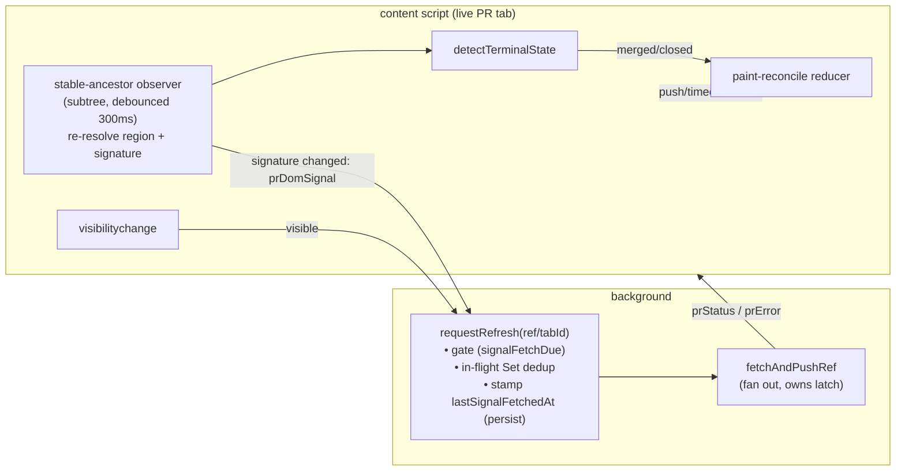

# feat: Signal-driven PR status refresh

## Overview

Floodgate's PR-status favicon updates only on the 1-minute `chrome.alarms` poll,
so a merge / approval / check completion is reflected up to ~60s late (up to ~5
min on the slow tier). This plan adds two fast **signals** — a DOM-mutation poke
from the live PR page and a re-poll when a hidden tab becomes visible — funneled
through a single background-side refresh entry point, plus an optimistic
favicon paint for the unambiguous merged/closed transition. The GraphQL API
stays the source of truth; signals decide *when* to fetch, not *what* the status
is (the one exception is the optimistic terminal paint, which is reconciled by a
confirming fetch).

The whole feature is a **foreground-latency optimization** layered on top of the
existing poll — background/discarded tabs keep their current alarm coverage
unchanged.

## Problem Frame

The favicon lags the page the user is actively looking at: they watch GitHub
render "merged" while the favicon still reads "open" for the better part of a
minute. The page already knows the instant state changes, and the content script
already runs a `MutationObserver` (today only to defend its own favicon). Two
existing signals that could drive a fast refresh don't: `visibilitychange` only
does unread-latch bookkeeping and never re-polls; refresh triggers are scattered
across the alarm, `tokenChanged`, and `registerPr` paths with no shared "request
a refresh" notion (see origin: `docs/brainstorms/2026-06-24-signal-driven-pr-refresh-requirements.md`).

The durable correctness wins are the visibility re-poll and faster catch-up on
review/check changes; the instant terminal paint is polish on top.

## Requirements Trace

- R1. A single background-side entry point for **signal-triggered** refreshes
  (DOM poke + visibility), instead of scattered direct fetch calls. (`tokenChanged`
  and the alarm tick are deliberately *not* routed through it — see Key Decisions.)
- R2. The entry point enforces a per-ref minimum interval between signal fetches
  **and** drops a signal whose ref already has a fetch in flight (in-flight
  dedup), then fans out one result to all tabs showing that ref.
- R3. Tier cadence (`pollTier`/`isPollDue`) governs the alarm path only; signals
  bypass the fast/slow throttle (but not the min-interval), and are suppressed
  for `stop`-tier refs.
- R4. Live PR tab observes for mutations and emits a debounced poke (no parsed
  values) only when a cheap, stable-hook **signature** of the mergebox/review/
  check summary actually changes — so streaming CI logs/comments don't poke.
- R5. The observer is attached to a **stable ancestor** that survives Turbo
  sub-tab navigation and re-resolves the mergebox region inside its callback, so
  it keeps working across Conversation/Files/Checks swaps and picks up a
  late-rendered mergebox; it no-ops when the region is absent.
- R6. Hybrid terminal fast-path: optimistically paint merged/closed immediately,
  then confirm via fetch; a pure reconcile state machine defines every outcome
  (agree / disagree / error / no-confirm-timeout) so a wrong paint can't strand.
- R7. Terminal detection and the signature use stable hooks only (`data-testid`,
  `aria-label`, Octicon class), never content-hashed CSS-module class names.
- R8. Becoming-visible tab requests a refresh through the entry point (in
  addition to today's latch bookkeeping).
- R9. Visibility re-poll is gated by the per-ref min-interval; cross-PR bursts
  are naturally user-paced (one tab is focused at a time) so no global throttle
  is needed beyond the per-ref gate + in-flight dedup.
- R10. Per-ref min-interval bounds signal fetches, its timestamp persisted to
  `chrome.storage.session` so SW eviction can't reset the guard; tier-aware.
- R11. Degrades safely to poll-only if GitHub's DOM changes, with a self-check
  log (fired after a settle delay, and on a detached observe-target) so the
  silent fallback is observable.
- R12. DOM signals never replace the central poll; background/discarded tabs
  stay alarm-covered exactly as today.

## Scope Boundaries

- No full DOM inference of review/check state — only the narrow merged/closed
  terminal paint is read from the DOM; all else is a trigger.
- No change to the favicon visual model, unread-latch semantics, watched-repos,
  or box-select.
- No new GitHub permissions, env vars, CI config, or exported/public API; the
  one new message type is internal content↔background IPC.

### Deferred to Separate Tasks

- Event-driven SPA-nav (replacing `setInterval(onNav, 1000)` with Turbo /
  `pushState` events): a future entry-point client, separate iteration.
- Tapping GitHub's live-updates SSE / socket channel or `webRequest`
  interception: possible future signals, out of scope.

## Context & Research

### Relevant Code and Patterns

- `background/index.ts` — central poller: `pollAll` (by-ref coalescing lives
  **here**, in the synchronous `byRef` map per tick — NOT in `fetchAndPushRef`),
  `fetchAndPushRef` (fetch one ref, fan out, stamp `lastPolledAt`, run `onPoll`
  latch; **no in-flight dedup of its own**), `reconcilePollAlarm`,
  `handleVisibility` (latch bookkeeping only, never re-polls; `if (!entry) return`
  guard is the pattern for the missing-entry case), `prRegistry` (keyed by tabId)
  + `persistRegistry` (fire-and-forget mirror to `chrome.storage.session`), the
  `delay(150)` intra-tick stagger.
- `lib/poll-policy.ts` — `pollTier` (fast/slow/stop; `pollTier(undefined)` ⇒
  `fast`) and `isPollDue`; the model for the new pure gate.
- `lib/registry.ts` — `RegistryEntry` (gets the new `lastSignalFetchedAt` field).
- `lib/messages.ts` — typed `FaviconRequest` / `FaviconCommand` unions (gets the
  new `prDomSignal` request type).
- `contents/github-pr-favicon.ts` — existing head `MutationObserver`
  (`startObserver`, attaches to the **stable** `document.head`) and title
  observer; `register()`/`teardownToOriginal()` re-run on SPA-nav **only when the
  ref changes** (`onNav` early-returns on same ref); `reportVisibility` (sends the
  `visibility` message); `drawStatus` (sets `lastStatus`/`lastUnread` and paints);
  `prStatus` handler paints unconditionally, `prError` handler is
  `if (!lastDataUri) drawStatus("fetching")` — **inert once any favicon is drawn**.
- `lib/unread.ts` — `onPoll`/`onRegister`/`onVisibilityChange` latch helpers,
  untouched; the confirming fetch keeps owning the latch.

### Institutional Learnings

- None — `docs/solutions/` does not exist, and there is no `AGENTS.md`/`CLAUDE.md`
  guidance in the repo.

### External References

- None used — every MV3 primitive needed (`chrome.storage.session`,
  `chrome.alarms`, `MutationObserver`, typed messaging) already has a strong
  local pattern in this codebase.

### Test Convention

- `vitest.config.ts` includes **only `lib/**/*.test.ts`** and runs in **jsdom**.
  Pure logic lives in `lib/` and is unit-tested (`lib/poll-policy.test.ts` is the
  model); `background/index.ts` and `contents/*.ts` are wiring, verified manually.
  This plan therefore extracts **all three** pieces of risk-bearing logic into
  pure `lib/` modules — the gate decision (Unit 1), the DOM detection + signature
  (Unit 3), and the optimistic-paint reconcile state machine (Unit 6) — so the
  novel logic is unit-tested and only thin chrome.* glue is manual.

## Key Technical Decisions

- **Dedicated `lastSignalFetchedAt` field** (not reuse of `lastPolledAt`): the
  alarm path stamps `lastPolledAt` on every fetch, so reusing it would make a
  recent alarm poll suppress a legitimate signal (and vice-versa). Persisted via
  `persistRegistry`.
- **R2 is min-interval + in-flight dedup, not "reuse fetchAndPushRef's
  coalescing"**: `fetchAndPushRef` has no in-flight dedup (the only coalescing is
  `pollAll`'s intra-tick `byRef` map, which a signal path can't inherit), and
  stamping-before-await does not stop two independent near-simultaneous events
  from both firing. `requestRefresh` therefore keeps an in-flight `Set<refKey>`:
  add the ref before the await, remove it in a `finally`; a signal for a ref
  already in flight is dropped. The min-interval bounds rate across time, the set
  bounds concurrency.
- **Minimal entry point, not a framework**: `requestRefresh` wraps the existing
  `fetchAndPushRef` + the new gate + the in-flight set. `pollAll` keeps its
  tier-based due-selection; `tokenChanged` keeps its current `pollAll(true)`
  force-refresh (it must bypass the min-interval, and the alarm path is the right
  home for it). R1 is therefore scoped to *signal-triggered* refreshes — stated,
  not hidden.
- **Signals bypass tier throttle but not the min-interval, and are suppressed at
  `stop`**: merged/closed are absorbing — once a ref is known terminal, further
  signal fetches are pointless. First signal on an undefined status
  (`pollTier(undefined)` ⇒ `fast`, gate passes) is intended: a brand-new tab
  should fetch.
- **Tier-aware min-interval**: 10 s fast / 30 s slow.
- **Observer attaches to a stable ancestor, decoupled from ref-change**: the
  mergebox lives in the Turbo-swapped content region, and `register()`/`teardown`
  only re-run on *ref* change (same-PR sub-tab swaps keep the ref), so mirroring
  the head/title observers would leave the observer watching a detached node. The
  mergebox observer instead attaches once to a stable ancestor with
  `subtree: true` and re-resolves `findMergeboxRegion` inside its (debounced)
  callback — surviving sub-tab swaps and late-rendered mergeboxes. It pokes only
  when a cheap **signature** of the region (terminal state + review/check summary
  aria-labels) changes, so a chatty page (CI logs, comments) doesn't poke.
- **Reconcile is a pure state machine; the optimistic paint is client-only**: the
  content script snapshots the pre-paint `(status, unread)` baseline *before*
  painting (because `drawStatus` overwrites `lastStatus`), paints merged/closed,
  and starts a bounded timer. The reconcile reducer (pure, in `lib/`) consumes
  events — `authoritativePush` / `error` / `timeout` — and returns the paint
  command: **any** `prStatus` or `prError` for the ref cancels the timer
  (`prStatus` repaints authoritative — agree ⇒ same pixels, no flicker; disagree
  ⇒ corrected); `error` or `timeout` reverts to the snapshot baseline. The
  existing `prError` handler (inert once a favicon is drawn) is extended to drive
  this. Baseline fallback when there was no prior authoritative favicon
  (status undefined / "fetching"): restore the original GitHub favicon.

## Open Questions

### Resolved During Planning

- *Per-ref timestamp field?* → new `lastSignalFetchedAt`, persisted.
- *R2 coalescing?* → per-ref min-interval + in-flight `Set<refKey>` dedup; do not
  assume `fetchAndPushRef` coalesces concurrent calls (it doesn't).
- *Debounce / min-interval values?* → 300 ms debounce; 10 s/30 s tier-aware floor.
- *Signals bypass the `stop` tier?* → no, suppressed at `stop`. First-signal on
  undefined status → intended fetch.
- *R8 message reuse vs new?* → extend the existing `visibility` path; token-gated.
- *Optimistic paint reconcile?* → pure reducer; snapshot baseline before paint;
  any push cancels the timer; error/timeout revert to baseline (or original
  favicon if no prior authoritative state).
- *Observer lifecycle vs the existing head observer?* → stable-ancestor observer
  with in-callback re-resolution, decoupled from ref-change (the head/title
  pattern doesn't transfer because the mergebox node is swapped).
- *`tokenChanged` routed through the entry point?* → no; it stays `pollAll(true)`
  as a force-refresh outside the min-interval. R1 scoped to signals.

### Deferred to Implementation

- The exact stable ancestor to observe (e.g. the persistent app/`<main>` wrapper
  vs `document.body`) and the durable mergebox container selector — confirmed
  against the live DOM; `findMergeboxRegion` returning null on a sub-tab is a
  valid no-op, not a failure.
- The bounded-wait revert duration — default ~6 s (or ~2× observed confirming
  fetch RTT), tuned during implementation; the reducer takes it as a parameter so
  the value is not baked into logic.

## High-Level Technical Design

> *This illustrates the intended approach and is directional guidance for review, not implementation specification. The implementing agent should treat it as context, not code to reproduce.*

Pure gate decision (Unit 1):

```
signalMinIntervalMs(tier):   fast -> 10_000 ;  slow -> 30_000 ;  stop -> (n/a)

signalFetchDue({ tier, lastSignalFetchedAt, now }):
  if tier == "stop":            return false      # absorbing — suppress (R3)
  if lastSignalFetchedAt == ∅:  return true       # never signal-fetched yet
  return now - lastSignalFetchedAt >= signalMinIntervalMs(tier)
```

Pure reconcile reducer (Unit 6) — events in, paint command out:

```
state: { pending: bool, baseline: FaviconState | "original" }

reconcile(state, event):
  optimisticTerminal(terminal, baselineSnapshot):
     -> { pending: true, baseline: baselineSnapshot }, cmd: paint(terminal) + startTimer
  authoritativePush(status):                 # prStatus arrived
     -> { pending: false }, cmd: paint(status) + cancelTimer     # agree: same pixels
  error:                                      # prError arrived
     -> { pending: false }, cmd: paint(baseline) + cancelTimer
  timeout:                                     # no push within bounded wait
     -> { pending: false }, cmd: paint(baseline)
  # any event while not pending -> no-op
```

Signal flow:



## Implementation Units

- [ ] **Unit 1: Persisted signal timestamp + pure refresh gate**

**Goal:** Add the per-ref signal-fetch timestamp and the pure decision that
gates signal-triggered fetches.

**Requirements:** R2, R3, R10

**Dependencies:** None

**Files:**
- Modify: `lib/registry.ts` (add `lastSignalFetchedAt?: number`, doc-commented as distinct from `lastPolledAt`)
- Create: `lib/refresh-gate.ts` (`signalMinIntervalMs(tier)`, `signalFetchDue({ tier, lastSignalFetchedAt, now })`)
- Create: `lib/refresh-gate.test.ts`

**Approach:** `signalFetchDue` takes a `PollTier` (caller computes via existing
`pollTier(entry.status)`), mirroring `isPollDue`. Stop-tier ⇒ false; fast/slow
gate only on the elapsed tier-aware interval.

**Patterns to follow:** `lib/poll-policy.ts` (`isPollDue` signature + the
`lib/poll-policy.test.ts` table style).

**Test scenarios:**
- Happy path: `lastSignalFetchedAt` undefined, fast tier → due (covers first-signal-on-undefined).
- Edge case: fetched 9.9 s ago fast → not due; 10 s ago → due.
- Edge case: slow tier honors 30 s (29 s → not due, 30 s → due).
- Edge case: `stop` tier → never due, even when `lastSignalFetchedAt` undefined.
- Happy path: `signalMinIntervalMs` returns 10 000 fast, 30 000 slow.

**Verification:** `pnpm test` + `pnpm typecheck` pass.

- [ ] **Unit 2: `requestRefresh` entry point (gate + in-flight dedup)**

**Goal:** A single signal-refresh entry point that gates, dedups in-flight,
stamps + persists `lastSignalFetchedAt`, and fans out via the existing fetch
helper.

**Requirements:** R1, R2, R9, R10, R12

**Dependencies:** Unit 1

**Files:**
- Modify: `background/index.ts` (`requestRefresh({ ref?, tabId? })`)

**Approach:**
- Resolve the target ref: if `tabId` given, `prRegistry.get(tabId)?.ref`; if
  `ref` given, use it. **Early-return when there is no registry entry for the
  ref/tabId** (mirrors `handleVisibility`'s `if (!entry) return`). `ref` wins if
  both are passed.
- Token check up front: no-op when `getToken()` is null (mirrors `pollAll`),
  keeping the alarm path (R12) untouched.
- Maintain a module-level `inFlightSignalRefs = new Set<string>()`. For the
  resolved ref: if already in the set → drop. Else compute
  `signalFetchDue(pollTier(entry.status), entry.lastSignalFetchedAt, now)`; if
  not due → drop. If due: add refKey to the set, stamp
  `entry.lastSignalFetchedAt = Date.now()`, `persistRegistry()`, `await
  fetchAndPushRef(ref, tabIdsForRef, token)`, and remove the refKey in a
  `finally`.
- Leave `pollAll`, `reconcilePollAlarm`, and `tokenChanged → pollAll(true)`
  unchanged.

**Patterns to follow:** `handleRegisterPr`'s `getToken()` early return and
ref-match guard; `fetchAndPushRef`'s existing fan-out + `onPoll` latch;
`persistRegistry`.

**Test scenarios:** Test expectation: background wiring is not unit-tested per
the repo convention; the gate it depends on is covered in Unit 1. Verified
manually (below).

**Verification:** With a token + open PR tab: two signals for the same ref within
10 s → exactly one network fetch (service-worker Network panel); a second signal
for that ref *while the first fetch is still in flight* → dropped (no second
request); after 10 s a fresh signal fetches; no token → no fetch; a signal for a
tab with no registry entry → no throw, no fetch.

- [ ] **Unit 3: Pure mergebox DOM module (detect + signature)**

**Goal:** Locate the mergebox, detect the terminal state, and compute a cheap
change-signature — all from stable hooks, fully unit-tested.

**Requirements:** R7 (supports R4, R5, R6)

**Dependencies:** None

**Files:**
- Create: `lib/mergebox.ts` (`findMergeboxRegion(root)`, `detectTerminalState(root) → "merged"|"closed"|null`, `mergeboxSignature(root) → string`)
- Create: `lib/mergebox.test.ts`

**Approach:**
- `findMergeboxRegion` anchors on `[data-testid="mergebox-partial"]`.
- `detectTerminalState` reads `aria-label="Merged"`/`"Closed"` + Octicon class
  (`octicon-git-merge` / closed-PR icon); never matches `MergeBox-module__…`.
- `mergeboxSignature` builds a short string from stable hooks (terminal state +
  the review/check summary `aria-label`s) so the observer can poke only on a
  meaningful change. Returns a stable empty-signature when the region is absent.

**Patterns to follow:** pure-module + jsdom test style; the merged-state fragment
from the origin doc is the primary fixture.

**Test scenarios:**
- Happy path: merged fragment → `detectTerminalState` = `"merged"`; `findMergeboxRegion` returns the partial.
- Happy path: closed fragment (`aria-label="Closed"` + closed Octicon) → `"closed"`.
- Edge case: open mergebox (no terminal aria-label) → `null`.
- Edge case: region-absent root → `findMergeboxRegion` null, `detectTerminalState` null, `mergeboxSignature` stable empty value.
- Edge case: `mergeboxSignature` differs between open vs merged, and between two distinct review/check states; identical input → identical signature (stable).
- Error path (R7): a fragment whose only merged signal is a hashed `MergeBox-module__…` class → `null` (proves we don't rely on volatile classes).

**Verification:** `pnpm test` passes against the real pasted fragment.

- [ ] **Unit 4: DOM-mutation poke signal (stable-ancestor observer) + self-check**

**Goal:** Observe a stable ancestor on the live tab, poke the entry point only
when the mergebox signature changes, and surface silent degradation.

**Requirements:** R4, R5, R11

**Dependencies:** Unit 2, Unit 3

**Files:**
- Modify: `lib/messages.ts` (add `PrDomSignal = { type: "prDomSignal"; ref: PrRef }` to `FaviconRequest`)
- Modify: `contents/github-pr-favicon.ts` (add a long-lived mergebox `MutationObserver` on a stable ancestor with `{ childList: true, subtree: true }`, started once on content-script init and disconnected on `pagehide`; 300 ms trailing debounce → re-resolve region, compute `mergeboxSignature`, and `sendMessage({ type: "prDomSignal", ref })` only when the signature changed since the last poke; self-check: after a settle delay, if `findMergeboxRegion` is still null on a PR URL, `console.debug` once; also log if the previously-found region is now detached)
- Modify: `background/index.ts` (handle `prDomSignal` → `requestRefresh({ ref })`)

**Approach:**
- The observer is **not** gated on ref-change; it lives on a stable ancestor and
  re-resolves the region each fire, so same-PR sub-tab swaps and late-rendered
  mergeboxes keep working (R5). Signature-diff gating keeps a chatty page quiet
  (R4). The poke carries only the current `ref` — pure trigger.

**Patterns to follow:** `startObserver`/`restoreOriginal` lifecycle and the
`pagehide` teardown already in `contents/github-pr-favicon.ts`; the
`FaviconRequest` union + `chrome.runtime.onMessage` dispatch in `background/index.ts`.

**Test scenarios:** Test expectation: content/background wiring is not unit-tested
per the repo convention; the region-finding + signature it depends on are covered
in Unit 3. Verified manually (below).

**Verification:** Merging a live PR (or a review submit / check flip) repaints the
favicon within a couple seconds, not at the next alarm tick; navigating
Conversation↔Files↔Checks keeps the observer firing (the poke still fires after a
sub-tab swap); a burst of CI-log/comment mutations that don't change the summary
yields **no** pokes (signature unchanged); on a PR with no detectable mergebox the
self-check logs once after the settle delay and the extension still works on the
poll cadence.

- [ ] **Unit 5: Visibility re-poll**

**Goal:** When a hidden PR tab becomes visible, refresh it through the entry
point instead of waiting for the next alarm tick.

**Requirements:** R8, R9

**Dependencies:** Unit 2

**Files:**
- Modify: `background/index.ts` (`handleVisibility`: when `visible === true`, after the existing latch bookkeeping, call `requestRefresh({ tabId })`)

**Approach:** Extend the existing `visibility` message path — no new message type.
The re-poll is gated by the same `signalFetchDue` + in-flight set and token-gated
inside `requestRefresh`. Cross-PR bursts are naturally user-paced (one tab is
focused at a time), so the per-ref gate suffices (R9).

**Patterns to follow:** existing `handleVisibility` + `reportVisibility` flow.

**Test scenarios:** Test expectation: none unit-tested (background wiring; gate
covered in Unit 1). Verified manually.

**Verification:** Background a PR tab, change its state on GitHub, wait past one
alarm tick, focus the tab → favicon updates promptly on focus; rapidly toggling
focus on the same tab does not exceed one fetch per the min-interval.

- [ ] **Unit 6: Optimistic terminal paint + pure reconcile state machine**

**Goal:** Paint merged/closed instantly on the live tab and reconcile every
outcome through a tested pure reducer, so a wrong/stale paint can never strand.

**Requirements:** R6

**Dependencies:** Unit 3, Unit 4

**Files:**
- Create: `lib/paint-reconcile.ts` (pure reducer: state `{ pending, baseline }`; events `optimisticTerminal` / `authoritativePush` / `error` / `timeout`; returns `{ nextState, command }` where command is a paint instruction + timer start/cancel)
- Create: `lib/paint-reconcile.test.ts`
- Modify: `contents/github-pr-favicon.ts` (in the observer callback, run `detectTerminalState`; on a terminal result, **snapshot** the pre-paint `(lastStatus, lastUnread)` baseline first, drive the reducer's `optimisticTerminal` event → paint + start a bounded timer, then send `prDomSignal`; route incoming `prStatus`/`prError`/timeout through the reducer; extend the `prError` handler so it actively reverts when a paint is pending instead of its current `if (!lastDataUri)` no-op)

**Approach:**
- Client-only paint; `fetchAndPushRef` owns the registry + latch. Any `prStatus`
  or `prError` for the ref cancels the timer; `prStatus` repaints authoritative
  (agree ⇒ no flicker, disagree ⇒ corrected); `error`/`timeout` revert to the
  snapshot baseline, or restore the original GitHub favicon if there was no prior
  authoritative state (status undefined/"fetching"). The reducer takes the
  bounded-wait duration as a parameter (default ~6 s).

**Patterns to follow:** `drawStatus` + the `prStatus`/`prError` handlers in
`contents/github-pr-favicon.ts`; the optimistic clear-on-focus in
`reportVisibility` is the precedent for client-side optimistic paint.

**Test scenarios (pure reducer — the risk-bearing logic):**
- Happy path: `optimisticTerminal("merged", baseline)` while idle → command paints merged, starts timer, state pending.
- Happy path (agree): then `authoritativePush(mergedStatus)` → paints authoritative, cancels timer, state idle (no revert possible afterward).
- Error path (disagree): `optimisticTerminal("merged")` then `authoritativePush(openStatus)` → paints open (corrected), cancels timer.
- Error path: `optimisticTerminal` then `error` → paints baseline, cancels timer.
- Error path: `optimisticTerminal` then `timeout` → paints baseline.
- Edge case: any event while not pending → no-op (e.g. a routine poll `authoritativePush` with no optimistic paint outstanding does not revert anything).
- Edge case: baseline `"original"` (no prior authoritative favicon) → revert command restores the original favicon, not a re-paint of `"fetching"`.

**Verification:** Merging a PR repaints to merged within ~1–2 s (before the
confirming fetch returns); a confirming fetch that agrees leaves it stable (no
flicker, no late revert); with the token cleared, the optimistic paint reverts
after the bounded wait; using devtools to force the confirming response to `open`
reverts the favicon to open (disagree path).

## System-Wide Impact

- **Interaction graph:** `prDomSignal` and the extended `visibility` branch both
  converge on `requestRefresh` → `fetchAndPushRef`; the alarm path
  (`pollAll`/`reconcilePollAlarm`) and `tokenChanged → pollAll(true)` are
  unchanged.
- **Error propagation:** signal fetches reuse `fetchAndPushRef`, so auth/network
  errors surface via `prError` + error badge; the content-side reducer adds a
  revert path so `prError` no longer silently strands an optimistic paint.
- **State lifecycle risks:** `lastSignalFetchedAt` is mirrored to
  `chrome.storage.session` via `persistRegistry`, so the min-interval guard
  survives SW eviction (best-effort: a SW killed in the sub-second window before
  the async `set` lands could lose one stamp — acceptable, the gate still bounds
  rate). The in-flight `Set` is per-SW-lifetime; a respawn can't see a prior
  worker's in-flight fetch — acceptable, the min-interval still bounds rate.
- **API surface parity:** no external API surface; one internal message type
  added to `FaviconRequest`.
- **Integration coverage:** the three risk-bearing seams (gate, DOM detect +
  signature, reconcile reducer) are pure and unit-tested; the chrome.* glue
  (`requestRefresh`, the observer, the `prStatus`/`prError`/timeout dispatch to
  the reducer) is the only manually-verified part.
- **Unchanged invariants:** the favicon visual model, unread-latch semantics
  (`lib/unread.ts`), watched-repos, box-select, and the alarm-driven polling of
  background/discarded tabs (R12) are explicitly unchanged.

## Risks & Dependencies

| Risk | Mitigation |
|------|------------|
| `prError` historically a no-op once a favicon is drawn → optimistic paint strands | Reducer + extended `prError` handler actively revert when a paint is pending; covered by `lib/paint-reconcile.test.ts` |
| Optimistic paint clobbers its own revert baseline (`drawStatus` sets `lastStatus`) | Snapshot the pre-paint baseline before painting; reducer reverts to the snapshot, not to `lastStatus` |
| Revert timer fires after a correct confirm → flicker | Any `prStatus`/`prError` for the ref cancels the timer; "no-confirm" means timer elapsed with no push seen |
| Observer dies on sub-tab swap (mergebox node replaced; `register` only re-runs on ref change) | Attach to a stable ancestor with `subtree:true`, re-resolve region in-callback; not gated on ref-change |
| R2 double-fetch (no in-flight dedup in `fetchAndPushRef`) | Explicit in-flight `Set<refKey>` in `requestRefresh` |
| GitHub rotates mergebox `data-testid`/`aria-label`/Octicon hooks | Detection isolated in `lib/mergebox.ts`; R11 self-check (settle-delay + detached-target) logs the silent fallback; poll keeps working |
| Chatty page floods pokes | Signature-diff gating (poke only on a meaningful summary change) + 300 ms debounce + per-ref min-interval |
| SW eviction resets the rate guard | `lastSignalFetchedAt` persisted to `chrome.storage.session`, read before fetching |

## Documentation / Operational Notes

- README feature bullets ("updated live") remain accurate; no user-facing setting
  changes, no new permissions, so no Web Store review-surface change.

## Sources & References

- **Origin document:** [docs/brainstorms/2026-06-24-signal-driven-pr-refresh-requirements.md](../brainstorms/2026-06-24-signal-driven-pr-refresh-requirements.md)
- Related code: `background/index.ts`, `lib/poll-policy.ts`, `lib/registry.ts`, `lib/messages.ts`, `contents/github-pr-favicon.ts`, `lib/unread.ts`
- Test setup: `vitest.config.ts` (jsdom, `lib/**/*.test.ts`)
